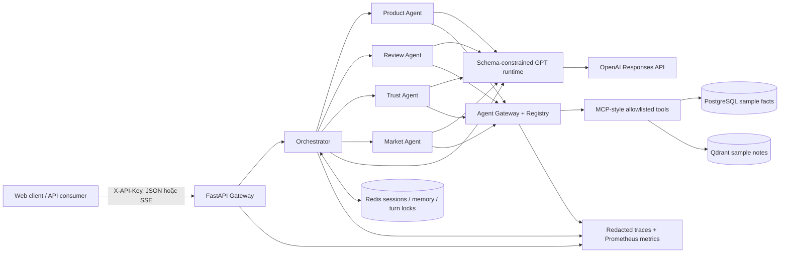

# Thương Trí — Vietnamese E-commerce Multi-Agent Platform

Thương Trí là hệ thống hỗ trợ quyết định mua sắm tiếng Việt theo hướng
**evidence-first multi-agent**. Phiên bản `1.0.0` hiện thực hóa MVP ứng dụng của
kiến trúc trong [`workflow.md`](workflow.md) dưới dạng modular monolith có ranh
giới sẵn sàng tách dịch vụ: API Gateway, Orchestrator,
Product/Review/Trust/Market Agents, Agent Gateway, Registry, MCP-style tool
catalog, shared state, vector knowledge, observability và evaluation.

> **Phạm vi dữ liệu:** Compose mặc định dùng 5 shop, 30 sản phẩm, 150 review và
> market notes là **dữ liệu mẫu tổng hợp, deterministic** để regression. Repository đồng thời
> giữ một snapshot Tiki Books public nhỏ (200 sản phẩm, 1.773 review, CC0) để
> demo ingestion/provenance; snapshot này vẫn là dữ liệu mẫu, không đại diện cho
> Shopee, Tiki, Lazada hay thị trường thương mại điện tử thật.

Đây là reference implementation production-oriented cho khóa luận ứng dụng,
không phải tuyên bố đã được chứng nhận vận hành Internet công cộng. Triển khai
thật vẫn cần TLS/reverse proxy, secret manager, backup policy, giám sát bên
ngoài và kiểm thử tải theo SLO cụ thể.

## Kiến trúc đã triển khai



Luồng recommendation đa miền dùng một DAG ba nhánh: Product Agent xếp hạng tối
đa 5 ứng viên, Review Agent và Trust Agent phân tích cùng tập ứng viên, sau đó
Orchestrator tổng hợp bằng công thức có phiên bản. Nếu một tín hiệu thiếu ở bất
kỳ ứng viên nào, tín hiệu đó bị bỏ cho cả nhóm và trọng số được chuẩn hóa lại để
không vô tình thưởng cho ứng viên thiếu dữ liệu.

| Khối | Trách nhiệm chính | Guardrail |
| --- | --- | --- |
| API Gateway | Auth, rate limit, correlation, timeout, JSON/SSE | Stable error envelope; owner-bound session |
| Orchestrator | GPT-assisted route/plan/synthesis, execute DAG | Python sở hữu entity, claim text, citation và deterministic fallback |
| Intent registry | Intent owner, session handoff, deterministic DAG template | Domain mới đăng ký manifest thay vì sửa router/planner/orchestrator core |
| Domain Agents | Product, review, trust, market + GPT specialist selection | Model chỉ chọn fact ID trong catalog do server tạo |
| Agent Gateway | Registry, permission, MCP routing, audit | Không log prompt hay raw tool arguments |
| Shared Platform | Redis session/memory/turn lock, telemetry | TTL, optimistic update, bounded local traces |
| Data Platform | PostgreSQL + Alembic, Qdrant sample knowledge | Idempotent seed; refuse mixed/non-sample DB |
| Evaluation | Paired v2 + ablations + robustness corpus | Pinned protocol/pricing; hashes; paired CI/bootstrap |

Chi tiết: [kiến trúc](docs/architecture.md), [API](docs/api.md),
[vận hành](docs/operations.md), [đánh giá](docs/evaluation.md).

## Tính năng chính

- Tìm kiếm, xếp hạng và so sánh sản phẩm bằng facts có nguồn.
- Phân tích sentiment/aspect review và complaint/trust theo heuristic có phiên
  bản, không trình bày như ML model đã huấn luyện.
- Recommendation kết hợp Product + Review + Trust cho toàn bộ top-N ứng viên.
- GPT tham gia thật ở bốn stage: routing, capability planning, specialist
  selection và grounded synthesis ordering. Router không được thêm entity ngoài
  kết quả Python; specialist/synthesis chỉ chọn ID trong catalog do server tạo,
  còn Python render fact, claim text và citation.
- Market Agent dùng thống kê PostgreSQL và market notes mẫu qua Qdrant.
- Session/follow-up có ownership theo principal, TTL và khóa lượt phân tán Redis.
- Streaming SSE có progress thật, heartbeat, terminal `completed`/`error` duy
  nhất và hỗ trợ client cancellation.
- Web client responsive, CSP chặt, DOM rendering an toàn, API key chỉ giữ trong
  memory của trang và evidence rail hiển thị executions/provenance.
- `/livez`; production `/readyz` kiểm tra migration hiện hành, Redis và
  collection Qdrant đúng vector contract, đã có dữ liệu; protected `/metrics`,
  trace/audit/agent inventory.
- Alembic migration, fail-safe sample seed, non-root read-only container,
  private data network, Helm production/kind profiles, NetworkPolicy và CI
  lint/type/test/wheel/container/chart gates.

## Khởi động production-like bằng Docker Compose

Yêu cầu Docker Compose v2. Stack chỉ publish backend tại
`127.0.0.1:8000`; PostgreSQL, Redis và Qdrant không mở cổng ra host.

```powershell
Copy-Item .env.example .env
# Mở .env và thay TẤT CẢ placeholder bằng secret URL-safe, duy nhất.
docker compose --env-file .env config --quiet
docker compose --env-file .env up --build -d
docker compose --env-file .env ps
```

Các giá trị tối thiểu phải thay:

- `POSTGRES_PASSWORD`, `REDIS_PASSWORD`: mật khẩu URL-safe vì nằm trong internal
  connection URL.
- `GATEWAY_API_KEYS`: `principal:secret[,principal:secret]`; client chỉ gửi phần
  `secret` trong `X-API-Key`.
- `GATEWAY_PRINCIPAL_POLICIES`: policy quyền tin cậy theo format
  `principal:tenant:scope1|scope2`; không cấu hình mặc định scope cho mọi principal.
- `OPERATIONS_API_KEY`: secret riêng cho metrics/traces/audit, tối thiểu 16 ký tự.
- `QDRANT_API_KEY`: secret không phải placeholder, tối thiểu 16 ký tự.

Ứng dụng production cố ý **không khởi động** khi dùng demo key, default DB
credential, Redis không mật khẩu, placeholder Qdrant, memory state, static
knowledge hoặc legacy `/chat`.

Compose thực hiện theo thứ tự có điều kiện:

```text
PostgreSQL healthy → Alembic migrate → sample DB seed ┐
Qdrant started → bounded sample knowledge seed        ├→ backend ready
Redis healthy                                         ┘
```

Mở `http://127.0.0.1:8000`, nhập **secret** tương ứng principal vào dialog và
thử:

1. `Tìm tai nghe dưới 1 triệu, bán tốt và ít bị khách phàn nàn.`
2. `So sánh Nova Air S2 với Sonic G5.`
3. `Khách hàng đánh giá thế nào về Tai nghe Bluetooth Nova Air S2?`
4. `Khách hàng đánh giá thế nào về SuperDragon X999?`

Không đưa dịch vụ HTTP này trực tiếp lên Internet. Hãy đặt sau reverse proxy TLS
và chỉ cấu hình HSTS khi HTTPS đã được đảm bảo end-to-end; xem
[runbook vận hành](docs/operations.md).

## Triển khai Kubernetes bằng Helm

Chart tại [`deploy/helm/ecommerce-multi-agent`](deploy/helm/ecommerce-multi-agent)
có hai profile được schema-gate:

- `values.yaml` cho production: một application replica, dependency managed bên
  ngoài, existing Secret, Alembic migration hook, sample seed tắt mặc định;
- `values-kind.yaml` cho smoke: dependency nội bộ có PVC, migrate/seed tuần tự,
  model `off` và hashing embedding để không cần network/provider key.

Chart dùng non-root/read-only security context, drop capabilities, probes,
resource budget, ClusterIP và NetworkPolicy. Monitoring tùy chọn cung cấp
ServiceMonitor, PrometheusRule và Grafana dashboard. Lệnh production/kind đầy
đủ, bao gồm cách cấp secret không commit manifest nhạy cảm, nằm trong
[runbook](docs/operations.md#4-triển-khai).

## Chạy local tối giản

Python `3.12+` được hỗ trợ. Có thể dùng SQLite cho local demo/tests; production
bắt buộc PostgreSQL theo validation runtime.

```powershell
python -m venv .venv
.\.venv\Scripts\Activate.ps1
python -m pip install -r requirements-dev.lock
python -m pip install --no-build-isolation --no-deps -e .

Push-Location frontend
npm ci
npm run build
Pop-Location

$env:APP_ENV = "development"
$env:DATABASE_URL = "sqlite+pysqlite:///./local-sample.db"
$env:GATEWAY_API_KEYS = "demo:demo-local-key"
$env:GATEWAY_PRINCIPAL_POLICIES = "demo:default:ecommerce.read"
$env:SHARED_STATE_BACKEND = "memory"
$env:KNOWLEDGE_BACKEND = "static"
$env:LEGACY_CHAT_ENABLED = "true"
$env:MODEL_RUNTIME_MODE = "off"

ecommerce-migrate
ecommerce-seed
uvicorn app.main:app --reload
```

Đường `/api/v1` hỗ trợ bốn chế độ model runtime:

| Mode | Hành vi |
| --- | --- |
| `off` | Không gọi model; dùng pipeline deterministic để phát triển/regression offline |
| `shadow` | Gọi model và thu telemetry nhưng giữ quyết định deterministic |
| `hybrid` | Dùng model output hợp lệ; lỗi/vi phạm policy fallback deterministic |
| `required` | Fail closed nếu model call hoặc authorization check thất bại |

Mặc định là `hybrid`: routing/specialist dùng `gpt-5.4-nano`, planning/synthesis
dùng `gpt-5.4-mini`. Production yêu cầu `OPENAI_API_KEY` khi runtime khác `off`.
Provider call dùng structured output, `store=false`, timeout/retry/concurrency
budget, circuit breaker và chỉ xuất metadata usage đã làm sạch vào trace. Mọi
lỗi provider/parser được ánh xạ sang allowlisted error code, không sao chép
payload lỗi vào API hoặc telemetry.

## API nhanh

JSON request:

```bash
curl -X POST http://127.0.0.1:8000/api/v1/chat \
  -H "Content-Type: application/json" \
  -H "X-API-Key: YOUR_SECRET" \
  -d '{"message":"Tìm tai nghe dưới 1 triệu"}'
```

SSE request:

```bash
curl -N -X POST http://127.0.0.1:8000/api/v1/chat/stream \
  -H "Content-Type: application/json" \
  -H "Accept: text/event-stream" \
  -H "X-API-Key: YOUR_SECRET" \
  -d '{"message":"Tìm tai nghe dưới 1 triệu, bán tốt và ít bị khách phàn nàn"}'
```

Client giữ `session_id` từ response để gửi follow-up. Session không tồn tại,
hết hạn hoặc thuộc principal khác đều trả cùng lỗi `404
gateway.session_not_found`, tránh rò rỉ ownership.

## Database và dữ liệu mẫu

- Alembic revision hiện tại: `20260824_0002` (`dataset_sources` + external IDs).
- Seed cố định: `random.seed(42)`, explicit IDs, 5 shop, 30 sản phẩm, 150 review.
- `ecommerce-seed` idempotent nếu database khớp chính xác snapshot mẫu.
- Snapshot Tiki Books được chuẩn hóa ở `data/snapshots/tiki-books-v4-sample`;
  import bằng `ecommerce-data import --snapshot ...` kiểm tra manifest/checksum,
  gắn version dataset vào từng product/review và có thể chạy lại an toàn.
- Seed từ chối database rỗng một phần, database lẫn dữ liệu khác hoặc dữ liệu
  thật; `--reset --confirm-reset` chỉ dùng local và bị chặn trong production.
- Knowledge seed hỗ trợ hashing vector `hashed_token_cosine_v1` cho regression
  offline và OpenAI embedding có version cho semantic retrieval. Hai vector
  space dùng collection riêng nên không thể bị trộn nhầm.

## Kiểm thử và quality gates

```powershell
Push-Location frontend
npm ci
npm run lint
npm test
npm run build
Pop-Location

python -m pip install -r requirements-dev.lock
ruff check app tests migrations
ruff format --check app tests migrations
mypy app
pytest -m "not integration" -q
python -m pip wheel --no-deps --wheel-dir dist .
```

CI chạy các bước trên, kiểm tra React bundle nằm trong Python wheel, validate
Compose, lint/render Helm bằng hai profile, kubeconform manifest và build Docker
image ba stage. Test offline dùng SQLite tạm, fakeredis và Qdrant mock contract;
chỉ test có marker `integration` cần OpenAI key/network thật. Không sửa thủ công
`app/frontend/dist`; đây là output của Vite.

## Evaluation khóa luận: paired protocol v2

Protocol v2 là đường đánh giá chính cho kiến trúc mới. Nó ghép cặp cùng case và
repetition giữa deterministic baseline với full hybrid, rồi chạy bốn ablation
`no_router`, `no_planner`, `no_specialist`, `no_synthesis`. Corpus gồm 28 clean
case v1 và 16 biến thể label-preserving cho typo, paraphrase, distractor và
prompt injection. Cấu hình freeze 3 correctness repetitions, 1 warmup, 5 latency
repetitions trên 7 case, thứ tự variant interleaved ngẫu nhiên tái lập bằng seed
`42`, 10.000 bootstrap samples và pricing manifest có hash.

Model snapshot được pin theo stage: `gpt-5.4-nano-2026-03-17` cho
routing/planning/specialist và `gpt-5.4-mini-2026-03-17` cho synthesis. Runner
pin thêm runtime policy không chứa secret (provider, timeout, retry, output,
concurrency, circuit breaker) và thực thi đúng retrieval
`hashed_token_cosine_v1`. Runner không gọi network nếu thiếu cờ đồng ý, từ chối
dirty worktree mặc định, ghi bundle qua staging/atomic rename rồi xác minh hash,
observation matrix, pricing và phép so sánh có thể recompute. Bundle `complete`
phải phủ chính xác mọi comparison/omission cell và robustness summary; artifact
thăm dò thủ công được ghi rõ `partial`.

```powershell
python -m app.evaluation.v2_runner run `
  --experiment evaluation/experiment.v2.json `
  --allow-network `
  --run-id run_thesis_v2

python -m app.evaluation.v2_runner validate `
  --bundle output/evaluation-v2/run_thesis_v2

python -m app.evaluation.v2_runner compare `
  --bundle output/evaluation-v2/run_thesis_v2 `
  --candidate hybrid_full `
  --metric task_success `
  --phase correctness
```

Live pilot có giới hạn đã chạy trên đúng provider path với một clean case, hai
variant và không có omission: hybrid gọi đủ 4 stage model, dùng `2.572` token,
chi phí ước tính `$0.00117795`, end-to-end latency khoảng `9.139 ms`.
Planning, specialist và synthesis thành công; routing output chứa entity không
extractive nên bị guard từ chối và chuyển sang deterministic fallback an toàn.
Task/routing/plan/retrieval/assertion vẫn đều `1.0` ở cả baseline và candidate.
Bundle được xác minh là `complete` theo ma trận mới.
Đây là **integration smoke**, không phải bằng chứng
superiority hay ước lượng latency đại diện. Bundle local bị ignore; protocol và
lệnh tái tạo được freeze tại
[`evaluation/experiment.live-pilot.v2.json`](evaluation/experiment.live-pilot.v2.json).

Chi tiết protocol, metric direction, win/tie/loss, paired bootstrap, robustness
và quy tắc diễn giải nằm trong [tài liệu evaluation](docs/evaluation.md).

### Artifact v1 lịch sử

Runner v1 vẫn được giữ để regression và tái kiểm tra các artifact khóa luận cũ:

```powershell
ecommerce-evaluate --repeats 3 --output evaluation/results/latest
```

Corpus có đúng 28 case, bốn case cho mỗi nhóm: simple, complex, multi-domain,
missing data, tool failure, ambiguous và irrelevant. Snapshot hiện tại nằm tại
[`evaluation/results/reference-v1/report.md`](evaluation/results/reference-v1/report.md).

Snapshot 28 case × 3 lần lặp đạt toàn bộ gold routing, plan, structured answer
assertions, retrieval và hai ca recoverable failure. Đây là **regression result
trên cùng hệ thống và dữ liệu mẫu**, không phải bằng chứng tổng quát hóa. Phase 1
đã có frozen single-agent real-model baseline từ `main` tại revision `c7b17cf`:
28/28 API turns thành công bằng `gpt-5.4-mini`, 58.878 token, p50 khoảng
3,405 ms và p95 khoảng 8,475 ms. Artifact raw và report nằm tại
[`evaluation/results/baseline-single-agent-v1`](evaluation/results/baseline-single-agent-v1).
Để đo Multi-Agent bằng model thật, chạy lệnh chủ động sau (không chạy trong CI
và không tự động gọi API):

```powershell
python scripts/run_real_multi_agent_benchmark.py --repeats 1
python scripts/run_real_multi_agent_benchmark.py --score-only
```

Runner dùng cùng 28 frozen case, seed dữ liệu mẫu và `gpt-5.4-mini`. Router,
planner và domain skills vẫn deterministic; API thật đảm nhiệm lớp tổng hợp cuối
trên một deterministic draft có provenance, nên model không được tự thay facts,
warning hoặc refusal. Kết quả capture hiện tại là 28/28 task, 86/86 answer
assertions, 31/31 retrieval, p50 1,168 ms, p95 2,042 ms và 61.778 token;
report cùng bảng so sánh descriptive nằm tại
[`evaluation/results/real-multi-agent-v1`](evaluation/results/real-multi-agent-v1).

| Metric | Multi-Agent real | Single-Agent main real | Delta (multi − single) |
| --- | ---: | ---: | ---: |
| Answer assertions | 100.00% | 12.79% | +87.21 pp |
| Exact plan | 100.00% | 50.00% | +50.00 pp |
| Retrieval F1 | 100.00% | 83.08% | +16.92 pp |
| Provenance coverage | 100.00% | 0.00% | +100.00 pp |
| Task success (frozen rubric) | 100.00% | 0.00% | +100.00 pp |
| Latency p50 | 1,168 ms | 3,405 ms | −2,238 ms |
| Latency p95 | 2,042 ms | 8,475 ms | −6,433 ms |
| Token usage | 61,778 | 58,878 | +2,900 |

Đây là mô tả **lịch sử v1** trên cùng model và corpus nhưng chưa phải paired
win/tie/loss:
prompt, runtime orchestration và số repetition chưa đồng nhất; chi phí ghi `N/A`
vì chưa capture pricing/provider billing. Reference deterministic vẫn được giữ
để regression không phụ thuộc network. Report schema `1.1` và real artifact ghi
SHA-256 manifest của toàn bộ tệp Python trong `app/`, ràng buộc snapshot với
đúng source SUT đã chạy.

## Cấu trúc repository

```text
app/
├── gateway/          # HTTP/SSE, auth, middleware, operations
├── orchestrator/     # router, planner, DAG executor, aggregator, scoring
├── agents/           # Product, Review, Trust, Market
├── agent_gateway/    # permission/rate/audit boundary
├── registry/         # immutable bundles + intent/plan manifests
├── mcp/              # allowlisted tool catalog/router
├── shared/           # context, model/embedding runtime, Redis, telemetry
├── knowledge/        # Qdrant adapter, versioned embedding, sample notes
├── evaluation/       # paired protocol, execution, artifacts, comparison
├── frontend/         # same-origin accessible web client
├── db/, models/, repositories/, tools/
└── agent/, api/      # legacy Phase 1 path; disabled in production
migrations/           # Alembic lifecycle
deploy/helm/          # production/kind profiles + monitoring resources
evaluation/           # frozen v1/v2 corpus, experiments, pricing, reports
tests/                # offline regression + optional integration
```

## Giới hạn có chủ đích

- Dataset và knowledge base vẫn là mẫu tổng hợp theo yêu cầu hiện tại.
- Runtime đã dùng LLM có cấu trúc nhưng sentiment/trust facts vẫn là heuristic
  có version trên dữ liệu mẫu, chưa phải model được hiệu chỉnh trên dữ liệu thật.
- Rate limiter và telemetry aggregation nằm trong một process. Compose cố định
  một Uvicorn worker; scale-out cần distributed limiter và external telemetry.
- Trace ring buffer chỉ phục vụ chẩn đoán ngắn hạn và mất khi restart.
- Redis lưu tối đa 40 user/assistant turn entries mỗi session theo TTL. Model chỉ
  nhận message hiện tại và structured state (`active_agent`, `last_product_id`),
  chưa đưa free-text memory vào inference. Chưa có long-term
  preference/summary/artifact memory.
- Paired protocol v2 và live pilot đã sẵn sàng, nhưng full six-variant live run,
  semantic human rubric, load/soak và nhiều seed/model replication vẫn là
  follow-up trước mọi claim superiority.
- Helm đã được lint/render/kubeconform và smoke thật trên kind một node; HA,
  managed data services, ingress/TLS, backup restore và external monitoring vẫn
  phải được xác nhận trong môi trường production đích.

Những giới hạn này được giữ công khai để kết quả khóa luận có thể kiểm chứng và
không vượt quá bằng chứng hiện có.
