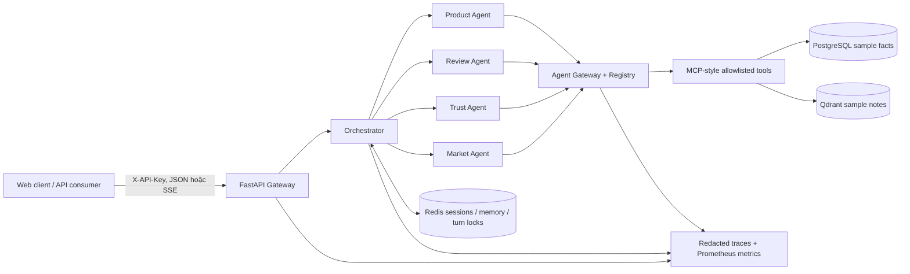

# Thương Trí — Vietnamese E-commerce Multi-Agent Platform

Thương Trí là hệ thống hỗ trợ quyết định mua sắm tiếng Việt theo hướng
**evidence-first multi-agent**. Phiên bản `1.0.0` hiện thực hóa MVP ứng dụng của
kiến trúc trong [`workflow.md`](workflow.md) dưới dạng modular monolith có ranh
giới sẵn sàng tách dịch vụ: API Gateway, Orchestrator,
Product/Review/Trust/Market Agents, Agent Gateway, Registry, MCP-style tool
catalog, shared state, vector knowledge, observability và evaluation.

> **Phạm vi dữ liệu:** Compose mặc định dùng 5 shop, 30 sản phẩm, 150 review và
> market notes là **dữ liệu mẫu tổng hợp, deterministic** để regression. Repository đồng thời
> giữ một snapshot Tiki Books public nhỏ (200 sản phẩm, 1.773 review, CC0) để
> demo ingestion/provenance; snapshot này vẫn là dữ liệu mẫu, không đại diện cho
> Shopee, Tiki, Lazada hay thị trường thương mại điện tử thật.

Đây là reference implementation production-oriented cho khóa luận ứng dụng,
không phải tuyên bố đã được chứng nhận vận hành Internet công cộng. Triển khai
thật vẫn cần TLS/reverse proxy, secret manager, backup policy, giám sát bên
ngoài và kiểm thử tải theo SLO cụ thể.

## Kiến trúc đã triển khai



Luồng recommendation đa miền dùng một DAG ba nhánh: Product Agent xếp hạng tối
đa 5 ứng viên, Review Agent và Trust Agent phân tích cùng tập ứng viên, sau đó
Orchestrator tổng hợp bằng công thức có phiên bản. Nếu một tín hiệu thiếu ở bất
kỳ ứng viên nào, tín hiệu đó bị bỏ cho cả nhóm và trọng số được chuẩn hóa lại để
không vô tình thưởng cho ứng viên thiếu dữ liệu.

| Khối | Trách nhiệm chính | Guardrail |
| --- | --- | --- |
| API Gateway | Auth, rate limit, correlation, timeout, JSON/SSE | Stable error envelope; owner-bound session |
| Orchestrator | Route, plan DAG, execute, aggregate | Typed A2A contracts; partial-failure semantics |
| Domain Agents | Product, review, trust, market analysis | Chỉ gọi skill được allowlist qua Agent Gateway |
| Agent Gateway | Registry, permission, MCP routing, audit | Không log prompt hay raw tool arguments |
| Shared Platform | Redis session/memory/turn lock, telemetry | TTL, optimistic update, bounded local traces |
| Data Platform | PostgreSQL + Alembic, Qdrant sample knowledge | Idempotent seed; refuse mixed/non-sample DB |
| Evaluation | 28 frozen cases × 7 workflow categories | Dataset/seed hashes; explicit N/A; honest baseline |

Chi tiết: [kiến trúc](docs/architecture.md), [API](docs/api.md),
[vận hành](docs/operations.md), [đánh giá](docs/evaluation.md).

## Tính năng chính

- Tìm kiếm, xếp hạng và so sánh sản phẩm bằng facts có nguồn.
- Phân tích sentiment/aspect review và complaint/trust theo heuristic có phiên
  bản, không trình bày như ML model đã huấn luyện.
- Recommendation kết hợp Product + Review + Trust cho toàn bộ top-N ứng viên.
- Market Agent dùng thống kê PostgreSQL và market notes mẫu qua Qdrant.
- Session/follow-up có ownership theo principal, TTL và khóa lượt phân tán Redis.
- Streaming SSE có progress thật, heartbeat, terminal `completed`/`error` duy
  nhất và hỗ trợ client cancellation.
- Web client responsive, CSP chặt, DOM rendering an toàn, API key chỉ giữ trong
  memory của trang và evidence rail hiển thị executions/provenance.
- `/livez`; production `/readyz` kiểm tra migration hiện hành, Redis và
  collection Qdrant đúng vector contract, đã có dữ liệu; protected `/metrics`,
  trace/audit/agent inventory.
- Alembic migration, fail-safe sample seed, non-root read-only container,
  private data network và CI lint/type/test/wheel/container gates.

## Khởi động production-like bằng Docker Compose

Yêu cầu Docker Compose v2. Stack chỉ publish backend tại
`127.0.0.1:8000`; PostgreSQL, Redis và Qdrant không mở cổng ra host.

```powershell
Copy-Item .env.example .env
# Mở .env và thay TẤT CẢ placeholder bằng secret URL-safe, duy nhất.
docker compose --env-file .env config --quiet
docker compose --env-file .env up --build -d
docker compose --env-file .env ps
```

Các giá trị tối thiểu phải thay:

- `POSTGRES_PASSWORD`, `REDIS_PASSWORD`: mật khẩu URL-safe vì nằm trong internal
  connection URL.
- `GATEWAY_API_KEYS`: `principal:secret[,principal:secret]`; client chỉ gửi phần
  `secret` trong `X-API-Key`.
- `OPERATIONS_API_KEY`: secret riêng cho metrics/traces/audit, tối thiểu 16 ký tự.
- `QDRANT_API_KEY`: secret không phải placeholder, tối thiểu 16 ký tự.

Ứng dụng production cố ý **không khởi động** khi dùng demo key, default DB
credential, Redis không mật khẩu, placeholder Qdrant, memory state, static
knowledge hoặc legacy `/chat`.

Compose thực hiện theo thứ tự có điều kiện:

```text
PostgreSQL healthy → Alembic migrate → sample DB seed ┐
Qdrant started → bounded sample knowledge seed        ├→ backend ready
Redis healthy                                         ┘
```

Mở `http://127.0.0.1:8000`, nhập **secret** tương ứng principal vào dialog và
thử:

1. `Tìm tai nghe dưới 1 triệu, bán tốt và ít bị khách phàn nàn.`
2. `So sánh Nova Air S2 với Sonic G5.`
3. `Khách hàng đánh giá thế nào về Tai nghe Bluetooth Nova Air S2?`
4. `Khách hàng đánh giá thế nào về SuperDragon X999?`

Không đưa dịch vụ HTTP này trực tiếp lên Internet. Hãy đặt sau reverse proxy TLS
và chỉ cấu hình HSTS khi HTTPS đã được đảm bảo end-to-end; xem
[runbook vận hành](docs/operations.md).

## Chạy local tối giản

Python `3.12+` được hỗ trợ. Có thể dùng SQLite cho local demo/tests; production
bắt buộc PostgreSQL theo validation runtime.

```powershell
python -m venv .venv
.\.venv\Scripts\Activate.ps1
python -m pip install -r requirements-dev.lock
python -m pip install --no-build-isolation --no-deps -e .

$env:APP_ENV = "development"
$env:DATABASE_URL = "sqlite+pysqlite:///./local-sample.db"
$env:GATEWAY_API_KEYS = "demo:demo-local-key"
$env:SHARED_STATE_BACKEND = "memory"
$env:KNOWLEDGE_BACKEND = "static"
$env:LEGACY_CHAT_ENABLED = "true"

ecommerce-migrate
ecommerce-seed
uvicorn app.main:app --reload
```

OpenAI không phải dependency của đường `/api/v1` hiện tại: routing, agents và
aggregation đều deterministic để benchmark tái lập. `OPENAI_API_KEY` chỉ phục
vụ đường single-agent Phase 1 cũ khi chủ động bật legacy endpoint hoặc chạy
integration test; production Compose tắt endpoint này.

## API nhanh

JSON request:

```bash
curl -X POST http://127.0.0.1:8000/api/v1/chat \
  -H "Content-Type: application/json" \
  -H "X-API-Key: YOUR_SECRET" \
  -d '{"message":"Tìm tai nghe dưới 1 triệu"}'
```

SSE request:

```bash
curl -N -X POST http://127.0.0.1:8000/api/v1/chat/stream \
  -H "Content-Type: application/json" \
  -H "Accept: text/event-stream" \
  -H "X-API-Key: YOUR_SECRET" \
  -d '{"message":"Tìm tai nghe dưới 1 triệu, bán tốt và ít bị khách phàn nàn"}'
```

Client giữ `session_id` từ response để gửi follow-up. Session không tồn tại,
hết hạn hoặc thuộc principal khác đều trả cùng lỗi `404
gateway.session_not_found`, tránh rò rỉ ownership.

## Database và dữ liệu mẫu

- Alembic revision hiện tại: `20260824_0002` (`dataset_sources` + external IDs).
- Seed cố định: `random.seed(42)`, explicit IDs, 5 shop, 30 sản phẩm, 150 review.
- `ecommerce-seed` idempotent nếu database khớp chính xác snapshot mẫu.
- Snapshot Tiki Books được chuẩn hóa ở `data/snapshots/tiki-books-v4-sample`;
  import bằng `ecommerce-data import --snapshot ...` kiểm tra manifest/checksum,
  gắn version dataset vào từng product/review và có thể chạy lại an toàn.
- Seed từ chối database rỗng một phần, database lẫn dữ liệu khác hoặc dữ liệu
  thật; `--reset --confirm-reset` chỉ dùng local và bị chặn trong production.
- Knowledge seed dùng deterministic hashing vector `hashed_token_cosine_v1`;
  đây là retrieval baseline tái lập, không phải semantic embedding model.

## Kiểm thử và quality gates

```powershell
python -m pip install -r requirements-dev.lock
ruff check app tests migrations
ruff format --check app tests migrations
mypy app
pytest -m "not integration" -q
python -m pip wheel --no-deps --wheel-dir dist .
```

CI chạy các bước trên, validate Compose và build Docker image. Test offline dùng
SQLite tạm, fakeredis và Qdrant mock contract; chỉ test có marker `integration`
cần OpenAI key/network thật.

## Benchmark khóa luận

```powershell
ecommerce-evaluate --repeats 3 --output evaluation/results/latest
```

Corpus có đúng 28 case, bốn case cho mỗi nhóm: simple, complex, multi-domain,
missing data, tool failure, ambiguous và irrelevant. Snapshot hiện tại nằm tại
[`evaluation/results/reference-v1/report.md`](evaluation/results/reference-v1/report.md).

Snapshot 28 case × 3 lần lặp đạt toàn bộ gold routing, plan, structured answer
assertions, retrieval và hai ca recoverable failure. Đây là **regression result
trên cùng hệ thống và dữ liệu mẫu**, không phải bằng chứng tổng quát hóa. Phase 1
chưa có frozen real-model baseline đủ provenance, nên report ghi
`baseline_unavailable`; token/cost production cũng ghi `N/A`, không thay bằng số
0 gây hiểu sai. Report schema `1.1` còn ghi SHA-256 manifest của toàn bộ tệp
Python trong `app/`, ràng buộc snapshot với đúng source SUT được chạy.

## Cấu trúc repository

```text
app/
├── gateway/          # HTTP/SSE, auth, middleware, operations
├── orchestrator/     # router, planner, DAG executor, aggregator, scoring
├── agents/           # Product, Review, Trust, Market
├── agent_gateway/    # permission/rate/audit boundary
├── registry/         # immutable agent bundles
├── mcp/              # allowlisted tool catalog/router
├── shared/           # context, Redis/memory session, telemetry
├── knowledge/        # Qdrant adapter, hashing embedder, sample notes
├── evaluation/       # schemas, metrics, runner
├── frontend/         # same-origin accessible web client
├── db/, models/, repositories/, tools/
└── agent/, api/      # legacy Phase 1 path; disabled in production
migrations/           # Alembic lifecycle
evaluation/           # frozen corpus, honest baseline manifest, reports
tests/                # offline regression + optional integration
```

## Giới hạn có chủ đích

- Dataset và knowledge base vẫn là mẫu tổng hợp theo yêu cầu hiện tại.
- Router/analytics là deterministic rules; chưa phải fine-tuned LLM hoặc mô hình
  sentiment/trust được hiệu chỉnh trên dữ liệu thật.
- Rate limiter và telemetry aggregation nằm trong một process. Compose cố định
  một Uvicorn worker; scale-out cần distributed limiter và external telemetry.
- Trace ring buffer chỉ phục vụ chẩn đoán ngắn hạn và mất khi restart.
- Redis lưu tối đa 40 user/assistant turn entries mỗi session theo TTL, nhưng
  deterministic router v1 chỉ tiêu thụ structured state (`active_agent`,
  `last_product_id`), chưa đưa free-text memory vào inference. Chưa có long-term
  user preference, conversation summary hay historical-artifact memory.
- Chưa có frozen single-agent real-model baseline, load/soak test hay disaster
  recovery drill trên hạ tầng thật.
- Qdrant live-container integration và Docker image build phải được CI/môi trường
  có Docker daemon xác nhận; unit suite dùng contract mocks.

Những giới hạn này được giữ công khai để kết quả khóa luận có thể kiểm chứng và
không vượt quá bằng chứng hiện có.
