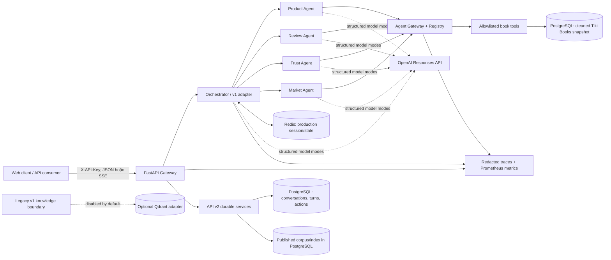

# Evidence Atlas — trợ lý sách Multi-Agent tiếng Việt

Evidence Atlas là reference implementation **production-oriented** cho trợ lý
quyết định sách dựa trên evidence. API v1 giữ nguyên đường tương thích lịch sử
cho Product, Review, Trust và Market agents trên snapshot Tiki Books; API v2 bổ
sung hội thoại, hành động và knowledge retrieval với trạng thái bền vững trong
PostgreSQL. Hai API có contract, lifecycle và bằng chứng riêng.

> **Ranh giới dữ liệu:** runtime mặc định dùng profile `eval` gồm 200 sách và
> 1.773 review, lấy mẫu deterministic từ Kaggle Tiki Books v4 đã truy xuất ngày
> 2026-08-24. Đây không phải API/feed Tiki trực tiếp và không phản ánh catalog,
> giá, tồn kho, người bán, review, xu hướng, nhu cầu hay thị phần hiện tại.

Seed runtime/test hiện hành không còn sinh catalog tổng hợp. Dữ liệu mẫu tổng
hợp 5 shop/30 sản phẩm/150 review chỉ còn trong một số artifact evaluation
generic được gắn nhãn legacy.

Repository phù hợp cho demo và khóa luận có thể kiểm chứng, không phải tuyên bố
đã vận hành Internet công cộng. Production thực tế vẫn cần TLS/reverse proxy,
secret manager, backup/restore, external monitoring và load/soak validation.

## Kiến trúc đã triển khai



Hệ thống là modular monolith: typed A2A/tool boundaries chạy trong một process
và có thể kiểm thử end-to-end. Bốn domain-agent ID cố định:

| Agent | Trách nhiệm |
| --- | --- |
| `product_agent` | Search/filter, compare và rank book metadata |
| `review_agent` | Retrieve, sentiment/aspect heuristic và summarize sampled reviews |
| `trust_agent` | Complaint/text-quality heuristic; không xác minh review giả |
| `market_agent` | Aggregate cắt ngang trên snapshot; không tạo trend/live-market claim |

Multi-domain recommendation chạy `product.rank`, sau đó
`review.compare`/`trust.compare` trên cùng tối đa 5 candidates. Python sở hữu
entity extraction, permission, DAG, facts, score, claim text và citation. Model
chỉ được chọn intent/capability/fact ID/claim ID trong schema có giới hạn; output
không grounded bị fallback hoặc fail closed theo runtime mode.

Với API v1, `KNOWLEDGE_BACKEND=disabled` vẫn là mặc định và Qdrant chỉ là seam
opt-in lịch sử. API v2 dùng `PostgresKnowledgeStore` trên PostgreSQL bền vững và
chỉ resolve một corpus/index đã publish, được pin bởi
`V2_CORPUS_VERSION_ID` và `V2_INDEX_MANIFEST_ID`; không dùng Qdrant path này.
Runtime v2 hiện pin `books-v1-calibrated-20260909`: 20 sources/chunks/vectors,
200 mappings (20 exact work, 17 ambiguous, 163 unmatched),
`text-embedding-3-small`/1536 dimensions. Benchmark Q/A và calibration artifacts
không nằm trong corpus.

Tài liệu chính:

- [Kiến trúc hiện hành](docs/architecture.md)
- [Vòng đời dữ liệu](docs/data.md)
- [API v1 và SSE](docs/api.md)
- [Đóng góp và verification](CONTRIBUTING.md)
- [Runbook vận hành](docs/operations.md)
- [Evaluation](docs/evaluation.md)
- [Design constitution](DESIGN.md)
- [Product brief](PRODUCT.md)

[`workflow.md`](workflow.md) chỉ là bản thiết kế e-commerce generic lịch sử.

## Khả năng chính

- Chỉ nhận câu hỏi sách; sản phẩm ngoài sách trả `general.unsupported`.
- Tìm theo title/free text, author, publisher, category, price, rating và page
  count; so sánh/ranking có công thức deterministic công khai.
- Review/complaint/text-quality heuristics có version và caveat rõ ràng.
- Market statistics chỉ là cross-sectional aggregates của snapshot.
- Agent Gateway kiểm soát tool/capability/permission, trả typed provenance và
  audit metadata đã redact.
- Session owner-bound, TTL, turn lock; Redis bắt buộc ở production.
- Model modes `off`, `shadow`, `hybrid`, `required`; structured output,
  `store=false`, timeout/retry/concurrency/circuit budgets.
- POST JSON và SSE streaming có correlation IDs, heartbeat, cancellation và
  đúng một terminal event.
- Same-origin responsive UI hiển thị answer, agent execution và evidence; API
  key chỉ ở memory của trang.
- Alembic, fail-closed snapshot bootstrap, non-root/read-only container,
  Compose/Helm và offline evaluation gates.
- API v2 có owner-bound conversation/turn/action state trong PostgreSQL; một
  turn pin catalog, corpus và index version rồi mới được dispatch.

## Vòng đời snapshot nhanh

Pipeline pin archive checksum, clean/deduplicate toàn nguồn, redact URL/email/
phone, normalize schema, chọn profile, quality-gate bốn artifacts rồi mới cho
import:

```powershell
ecommerce-data validate --snapshot data/snapshots/tiki-books-v4-eval
ecommerce-data download
ecommerce-data prepare `
  --profile eval `
  --output data/cache/reproduced-tiki-books-v4-eval
ecommerce-data validate `
  --snapshot data/cache/reproduced-tiki-books-v4-eval
ecommerce-migrate
ecommerce-seed --snapshot data/snapshots/tiki-books-v4-eval
```

Profiles:

| Profile | Mục đích | Snapshot |
| --- | --- | ---: |
| `test` | Fast regression | 24 sách / 115 review |
| `eval` | Runtime/evaluation mặc định | 200 sách / 1.773 review |
| `full` | Toàn bộ cleaned records, local only | Bị ignore, không commit |

Mỗi profile có `products.jsonl`, `reviews.jsonl`, `manifest.json` và
`quality-report.json`. Import idempotent theo
`(dataset_id, dataset_version, profile)` và từ chối artifact sai hash/count,
database mixed/legacy hoặc snapshot khác. Chi tiết/checksum nằm trong
[docs/data.md](docs/data.md).

## Khởi động production-like bằng Docker Compose

Yêu cầu Docker Compose v2. Default chỉ publish backend tại
`127.0.0.1:8000`; PostgreSQL/Redis nằm trên internal network. Qdrant không chạy
khi không bật profile `knowledge`.

```powershell
Copy-Item .env.example .env
# Mở .env và thay placeholder; không in/commit secret.
docker compose --env-file .env config --quiet
docker compose --env-file .env up --build -d
docker compose --env-file .env ps
```

Phải thay:

- `POSTGRES_PASSWORD`, `REDIS_PASSWORD`: URL-safe;
- `GATEWAY_API_KEYS`: `principal:secret[,principal:secret]`;
- `GATEWAY_PRINCIPAL_POLICIES`: `principal:tenant:scope1|scope2`;
- `OPERATIONS_API_KEY`: credential riêng, ít nhất 16 ký tự;
- `OPENAI_API_KEY` nếu `MODEL_RUNTIME_MODE` khác `off`.

Không cần `QDRANT_API_KEY` khi `KNOWLEDGE_BACKEND=disabled`. Startup order:

```text
PostgreSQL healthy → Alembic migrate → Tiki snapshot bootstrap → backend
Redis healthy ────────────────────────────────────────────────────┘
```

Thử các câu hỏi:

1. `Tìm sách Nhật Ký Tarot.`
2. `So sánh sách Sapiens với sách Quân Vương.`
3. `Khách hàng đánh giá sách Nhật Ký Tarot thế nào?`
4. `Gợi ý sách dưới 150.000 đồng, rating tốt và ít tín hiệu phàn nàn.`
5. `Thống kê sách lập trình trong snapshot.`

Mọi answer phải nêu đây là snapshot lịch sử. Xem [runbook](docs/operations.md)
trước khi đặt sau TLS proxy hoặc chạy Helm.

## Chạy local v1 tối giản

Yêu cầu Python 3.12+ và Node toolchain theo `frontend/package-lock.json`:

```powershell
python -m venv .venv
.\.venv\Scripts\Activate.ps1
python -m pip install -r requirements-dev.lock
python -m pip install --no-build-isolation --no-deps -e .

Push-Location frontend
npm ci
npm run build
Pop-Location

$env:APP_ENV = "development"
$env:DATABASE_URL = "sqlite+pysqlite:///./local-books.db"
$env:GATEWAY_API_KEYS = "demo:demo-local-key"
$env:GATEWAY_PRINCIPAL_POLICIES = "demo:default:ecommerce.read"
$env:SHARED_STATE_BACKEND = "memory"
$env:KNOWLEDGE_BACKEND = "disabled"
$env:LEGACY_CHAT_ENABLED = "true"
$env:MODEL_RUNTIME_MODE = "off"

ecommerce-migrate
ecommerce-seed
uvicorn app.main:app --reload
```

Cấu hình trên là đường v1/fixture dùng SQLite và knowledge boundary tắt. API v2
cần PostgreSQL bền vững cùng published corpus/index; không dùng cấu hình SQLite
này để kết luận v2 production đã sẵn sàng. Xem [API v2](docs/api.md) và
[runbook](docs/operations.md) để bind `V2_CORPUS_VERSION_ID` và
`V2_INDEX_MANIFEST_ID`.

Model runtime modes:

| Mode | Hành vi |
| --- | --- |
| `off` | Offline deterministic, không provider call |
| `shadow` | Thu model telemetry, giữ quyết định deterministic |
| `hybrid` | Dùng structured output hợp lệ, deterministic fallback |
| `required` | Fail closed khi provider/evidence authorization lỗi |

## API nhanh

```bash
curl -X POST http://127.0.0.1:8000/api/v1/chat \
  -H "Content-Type: application/json" \
  -H "X-API-Key: YOUR_SECRET" \
  -d '{"message":"Tìm sách Quân Vương và cho biết tác giả"}'
```

```bash
curl -N -X POST http://127.0.0.1:8000/api/v1/chat/stream \
  -H "Content-Type: application/json" \
  -H "Accept: text/event-stream" \
  -H "X-API-Key: YOUR_SECRET" \
  -d '{"message":"Gợi ý sách dưới 150.000 đồng, rating tốt và ít tín hiệu phàn nàn"}'
```

Client gửi lại `session_id` để follow-up. Session không tồn tại, hết hạn hoặc
thuộc principal khác đều dùng cùng lỗi `404 gateway.session_not_found`.

## Database, readiness và deployment

- Alembic production head: `20260910_0008` (the source constant is
  `app.db.migrate.EXPECTED_DATABASE_REVISION`).
- Default `PUBLIC_SNAPSHOT_DIR`: `data/snapshots/tiki-books-v4-eval`.
- `ecommerce-seed [--snapshot PATH]` là verifier/import bootstrap, không phải
  generator và không có reset flag.
- `/livez` chỉ kiểm tra process.
- `/readyz` kiểm tra runtime, DB/current production revision, Redis nếu cấu hình
  và knowledge boundary; default trả `knowledge: "disabled"`.
- Compose chạy migrate + bootstrap; Helm production tắt bootstrap để data import
  external được review riêng; kind bật bootstrap eval snapshot.
- Qdrant chỉ được kiểm tra khi opt-in backend `qdrant`; không có knowledge seed.

Lệnh xóa exact legacy synthetic seed chỉ dành cho database disposable và bị
chặn ở production:

```powershell
ecommerce-reset-legacy-seed `
  --confirm-disposable DELETE-LEGACY-SEED
```

## Kiểm thử và quality gates

```powershell
Push-Location frontend
npm ci
npm run lint
npm test
npm run build
Pop-Location

ruff check app tests migrations
ruff format --check app tests migrations
mypy app
pytest -m "not integration" -q
python -m pip wheel --no-deps --wheel-dir dist .
```

CI còn validate Compose/Helm, frontend bundle trong Python wheel và Docker image.
Offline tests dùng SQLite/fakeredis/mock adapters; chỉ tests có marker
`integration` cần provider/network. Không sửa tay `app/frontend/dist`.

## Evaluation

Repository giữ hai đường historical để tương thích và một đường Package 7/8
được freeze riêng. Paired v2 cũ dùng `tiki_books_vi_28_v1` và bảy variants:

```text
deterministic_book_catalog_v2
  → deterministic_v2
    → hybrid_full
      ├─ hybrid_no_router
      ├─ hybrid_no_planner
      ├─ hybrid_no_specialist
      └─ hybrid_no_synthesis
```

Full protocol đo 924 correctness + 245 latency = 1.169 observations, cộng 7
warmups bị loại. Chạy paired deterministic offline:

```powershell
python -m app.evaluation.v2_runner run `
  --experiment evaluation/experiment.v2.json `
  --variant deterministic_v2 `
  --run-id run_books_deterministic_v2

python -m app.evaluation.v2_runner validate `
  --bundle output/evaluation-v2/run_books_deterministic_v2
```

Checked-in historical v2 evidence là deterministic
[`evaluation/results/reference-v1`](evaluation/results/reference-v1). Repository
không có checked-in live-LLM result cho historical v2 corpus Tiki Books. Các
real-model report generic cũ dùng `sample_ecommerce_vi_28_v1`, nằm trong nhóm
legacy và không hỗ trợ current Tiki claim.

Package 7 đã freeze corrected v3 protocol hash
`385ae09e74a7e8e2896b170f9ad3f2549f6f79390e94b3241cd7da0e4b32721f`: bốn
variants, 20 development cases và 60 held-out cases. Pilot hiện hành hoàn tất
`36/36` terminal cells, global repeat decision chọn 3 repeats, với chi phí
pilot thực tế `0.05332290 USD` và held-out SUT dự kiến `5.72929200 USD`. Judge
semantic là automated model judge theo contract, không phải human judge.

Package 8 đã chạy SUT held-out nhưng hiện chỉ có terminal partial, chưa có
scoring, calibration, judge-complete hay benchmark-quality result. Run
`run_p8_heldout_corrected_v3` có `678/720` cells completed và `42` failed;
schedule SHA là
`a6002ab2dc15282bf4b26c79ffece061242065e8352e637a1a82623a8fa1fd71`. Record
này ghi nhận `792` generation/provider attempts, `0` retries, `0` embeddings,
known SUT cost `1.44856770 USD` và không còn unresolved reservation. `validate`,
`dry-run` và `prepare` không gọi provider; `run`/`resume` và lifecycle `operate`
chỉ được live khi truyền rõ `--allow-network`, `--database-url`; `operate` còn
cần hard limit judge per-job và fail-closed khi citation không mở lại được từ
immutable authority. P8 vẫn mở, chờ successor P7/P8 riêng sau source
remediation, exact evidence resolver, calibration/judging và các final gates.
Xem [phương pháp evaluation](docs/evaluation.md) để biết chi tiết.

## Cấu trúc repository

```text
app/
├── gateway/          # HTTP/SSE, auth, middleware, readiness/operations
├── orchestrator/     # book router, planner, DAG executor, aggregator/scoring
├── agents/           # Product, Review, Trust, Market specialists
├── agent_gateway/    # permission/rate/audit boundary
├── registry/         # bundles + domain-owned intent/plan manifests
├── mcp/, tools/      # allowlisted book/review/aggregate tools
├── data/             # pinned download, cleaning, profiles, quality gate
├── db/, models/      # migration, profile-bound import/bootstrap
├── knowledge/        # v1 disabled seam + v2 Postgres corpus/retrieval
├── evaluation/       # historical v1/v2 + frozen v3/P8 artifacts
├── frontend/         # same-origin accessible web client
└── shared/           # model runtime, Redis state, telemetry
data/snapshots/       # committed test/eval normalized fixtures
migrations/           # Alembic lifecycle
deploy/helm/          # production/kind profiles + monitoring
evaluation/           # frozen corpus, experiments, pricing, reports
tests/                # offline regression + optional integration
```

## Giới hạn có chủ đích

- Snapshot là sampled historical public data; seller/review timestamp coverage
  bằng 0 và không đại diện Tiki hay thị trường hiện tại.
- `source_popularity` được xuất qua tên tương thích `sold_count`; không được gọi
  là current sales hoặc doanh số đã xác minh.
- Sentiment/complaint/trust là heuristic trên sampled text, chưa phải calibrated
  model và không xác minh fraud/authenticity.
- Knowledge/RAG của v1 disabled; v2 dùng published PostgreSQL corpus/index đã
  pin, không coi đó là benchmark result.
- Redis giữ short-term bounded entries nhưng **chưa đưa free-text memory vào inference**.
  **Chưa có long-term** preference, summary hoặc artifact memory.
- Rate limiter, trace ring và metrics aggregation nằm trong một process; scale
  nhiều replica cần distributed replacements.
- Current held-out live-model evidence mới chỉ là một terminal partial; calibrated
  judge output, exact evidence resolver run, completed analysis matrix, human
  review, load/soak, fairness/drift và production HA vẫn chưa được xác minh.

Các giới hạn này là một phần của evidence contract, không phải footnote tùy
chọn.
