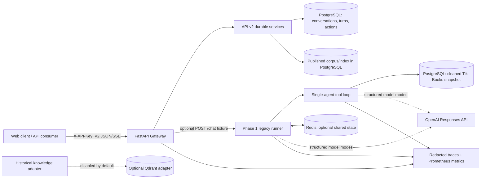

# Evidence Atlas — trợ lý sách Multi-Agent tiếng Việt

Evidence Atlas là reference implementation **production-oriented** cho trợ lý
quyết định sách dựa trên evidence. `/api/v2` là API HTTP có version duy nhất,
dùng PostgreSQL cho hội thoại, hành động và knowledge retrieval. Các endpoint
`/api/v1` đã bị gỡ; `POST /chat` chỉ còn là fixture Phase 1 riêng, có thể bật
trong môi trường development.

> **Ranh giới dữ liệu:** runtime mặc định dùng snapshot lịch sử Tiki Books,
> profile `eval` gồm 200 bản ghi sản phẩm và 1.773 review, lấy mẫu deterministic từ Kaggle
> Tiki Books v4 đã truy xuất ngày 2026-08-24. Đây không phải API/feed Tiki
> trực tiếp và không phản ánh catalog,
> giá, tồn kho, người bán, review, xu hướng, nhu cầu hay thị phần hiện tại.

Seed runtime/test hiện hành không còn sinh catalog tổng hợp. Dữ liệu mẫu tổng
hợp 5 shop/30 sản phẩm/150 review chỉ còn trong một số artifact evaluation
generic được gắn nhãn legacy.

Repository phù hợp cho demo và khóa luận có thể kiểm chứng, không phải tuyên bố
đã vận hành Internet công cộng. Production thực tế vẫn cần TLS/reverse proxy,
secret manager, backup/restore, external monitoring và load/soak validation.

## Kiến trúc đã triển khai


```mermaid
flowchart LR
    U[Web client / API consumer] -->|X-API-Key; V2 JSON/SSE| G[FastAPI Gateway]
    G --> V2[API v2 durable services]
    V2 --> PG2[(PostgreSQL: conversations, turns, actions)]
    V2 --> KI[(Published corpus/index in PostgreSQL)]
    G -. optional POST /chat fixture .-> O[Phase 1 legacy runner]
    O --> MA[Single-agent tool loop]
    MA --> PG[(PostgreSQL: cleaned Tiki Books snapshot)]
    O <--> RS[(Redis: optional shared state)]
    O & MA -. structured model modes .-> L[OpenAI Responses API]
    G & O & MA --> OBS[Redacted traces + Prometheus metrics]
    K[Historical knowledge adapter] -. disabled by default .-> Q[(Optional Qdrant adapter)]
```

Hệ thống là modular monolith: typed A2A/tool boundaries chạy trong một process
và có thể kiểm thử end-to-end. Bốn domain-agent ID cố định:

| Agent | Trách nhiệm |
| --- | --- |
| `product_agent` | Search/filter, compare và rank book metadata |
| `review_agent` | Retrieve, sentiment/aspect heuristic và summarize sampled reviews |
| `trust_agent` | Complaint/text-quality heuristic; không xác minh review giả |
| `market_agent` | Aggregate cắt ngang trên snapshot; không tạo trend/live-market claim |

API v2 là bounded hybrid multi-expert orchestration: supervisor điều phối các
expert/capability services, không instantiate bốn domain-agent classes của
orchestrator lịch sử. Các expert không có memory riêng hoặc tự thương lượng.
Recommendation chạy `product.rank`, rồi `review.compare`/`trust.compare` tuần tự
trên cùng tối đa 5 candidates. Review/trust bổ sung evidence; v2 không dùng
weighted reranking 55/15/20/10 của v1. Python sở hữu entity extraction,
permission, dependencies, facts, score và citation binding. Model chọn plan và
fact/evidence IDs trong schema có giới hạn; knowledge prose do model viết phải
qua exact-span và automated semantic verification. Các kiểm tra này có sai số,
không bảo đảm mọi câu trả lời đúng tuyệt đối.

Historical `KNOWLEDGE_BACKEND=disabled` vẫn là mặc định và Qdrant chỉ là adapter
tương thích cũ. API v2 dùng `PostgresKnowledgeStore` trên PostgreSQL bền vững và
chỉ resolve một corpus/index đã publish, được pin bởi
`V2_CORPUS_VERSION_ID` và `V2_INDEX_MANIFEST_ID`; không dùng Qdrant path này.
Runtime v2 hiện pin `books-v1-calibrated-20260909`: 20 sources/chunks/vectors,
200 mappings (20 exact work, 17 ambiguous, 163 unmatched),
`text-embedding-3-small`/1536 dimensions. Benchmark Q/A và calibration artifacts
không nằm trong corpus.

Tài liệu chính:

- [Kiến trúc hiện hành](docs/architecture.md)
- [Vòng đời dữ liệu](docs/data.md)
- [API v2 và SSE](docs/api.md)
- [Đóng góp và verification](CONTRIBUTING.md)
- [Runbook vận hành](docs/operations.md)
- [Evaluation](docs/evaluation.md)
- [Design constitution](DESIGN.md)
- [Product brief](PRODUCT.md)

[`workflow.md`](workflow.md) chỉ là bản thiết kế e-commerce generic lịch sử.

## Khả năng chính

- Miền công bố là sách; xem [contract từng runtime](docs/architecture.md).
  Snapshot bảo tồn cả record ngoài miền; guard runtime phải loại chúng khỏi
  candidates và aggregate, không sửa snapshot lịch sử để che dữ liệu nguồn.
- Tìm/so sánh/ranking trên metadata snapshot; khả năng parse câu tự nhiên của
  API v2 được kiểm chứng riêng với khả năng filter của repository/tool.
- Review/complaint/text-quality heuristics có version và caveat rõ ràng.
- Market statistics chỉ là cross-sectional aggregates của snapshot.
- Agent Gateway kiểm soát tool/capability/permission, trả typed provenance và
  audit metadata đã redact.
- Conversation/turn owner-bound và SQL lease trong v2; session TTL/Redis turn
  coordination thuộc compatibility runtime lịch sử.
- Model modes `off`, `shadow`, `hybrid`, `required`; structured output,
  `store=false`, timeout/retry/concurrency/circuit budgets.
- POST JSON và SSE streaming có correlation IDs, heartbeat, cancellation và
  đúng một terminal event.
- Same-origin responsive UI hiển thị answer, agent execution và evidence; API
  key chỉ ở memory của trang.
- Alembic, fail-closed snapshot bootstrap, non-root/read-only container,
  Compose/Helm và offline evaluation gates.
- API v2 có owner-bound conversation/turn/action state trong PostgreSQL; một
  turn pin catalog, corpus và index version rồi mới được dispatch.

## Vòng đời snapshot nhanh

Pipeline pin archive checksum, clean/deduplicate toàn nguồn, redact URL/email/
phone, normalize schema, chọn profile, quality-gate bốn artifacts rồi mới cho
import:

```powershell
ecommerce-data validate --snapshot data/snapshots/tiki-books-v4-eval
ecommerce-data download
ecommerce-data prepare `
  --profile eval `
  --output data/cache/reproduced-tiki-books-v4-eval
ecommerce-data validate `
  --snapshot data/cache/reproduced-tiki-books-v4-eval
ecommerce-migrate
ecommerce-seed --snapshot data/snapshots/tiki-books-v4-eval
```

Profiles:

| Profile | Mục đích | Snapshot |
| --- | --- | ---: |
| `test` | Fast regression | 24 sách / 115 review |
| `eval` | Runtime/evaluation mặc định | 200 bản ghi / 1.773 review; 199 sách hợp lệ trong v2 |
| `full` | Toàn bộ cleaned records, local only | Bị ignore, không commit |

Mỗi profile có `products.jsonl`, `reviews.jsonl`, `manifest.json` và
`quality-report.json`. Import idempotent theo
`(dataset_id, dataset_version, profile)` và từ chối artifact sai hash/count,
database mixed/legacy hoặc snapshot khác. Chi tiết/checksum nằm trong
[docs/data.md](docs/data.md).

## Khởi động production-like bằng Docker Compose

Yêu cầu Docker Compose v2. Default chỉ publish backend tại
`127.0.0.1:8000`; PostgreSQL/Redis nằm trên internal network. Qdrant không chạy
khi không bật profile `knowledge`.

```powershell
Copy-Item .env.example .env
# Mở .env và thay placeholder; không in/commit secret.
docker compose --env-file .env config --quiet
docker compose --env-file .env up --build -d
docker compose --env-file .env ps
```

Phải thay:

- `POSTGRES_PASSWORD`, `REDIS_PASSWORD`: URL-safe;
- `GATEWAY_API_KEYS`: `principal:secret[,principal:secret]`;
- `GATEWAY_PRINCIPAL_POLICIES`: `principal:tenant:scope1|scope2`;
- `OPERATIONS_API_KEY`: credential riêng, ít nhất 16 ký tự;
- `OPENAI_API_KEY` nếu `MODEL_RUNTIME_MODE` khác `off`.

Không cần `QDRANT_API_KEY` khi `KNOWLEDGE_BACKEND=disabled`. Startup order:

```text
PostgreSQL healthy → Alembic migrate → Tiki snapshot bootstrap → backend
Redis healthy ────────────────────────────────────────────────────┘
```

Thử các câu hỏi:

1. `Tìm sách Nhật Ký Tarot.`
2. `So sánh sách Sapiens với sách Quân Vương.`
3. `Khách hàng đánh giá sách Nhật Ký Tarot thế nào?`
4. `Gợi ý sách dưới 150.000 đồng, rating tốt và ít tín hiệu phàn nàn.`
5. `Thống kê sách lập trình trong snapshot.`

Mọi answer phải nêu đây là snapshot lịch sử. Xem [runbook](docs/operations.md)
trước khi đặt sau TLS proxy hoặc chạy Helm.

## Chạy fixture Phase 1 local

Yêu cầu Python 3.12+ và Node toolchain theo `frontend/package-lock.json`:

```powershell
python -m venv .venv
.\.venv\Scripts\Activate.ps1
python -m pip install -r requirements-dev.lock
python -m pip install --no-build-isolation --no-deps -e .

Push-Location frontend
npm ci
npm run build
Pop-Location

$env:APP_ENV = "development"
$env:DATABASE_URL = "sqlite+pysqlite:///./local-books.db"
$env:GATEWAY_API_KEYS = "demo:demo-local-key"
$env:GATEWAY_PRINCIPAL_POLICIES = "demo:default:ecommerce.read"
$env:SHARED_STATE_BACKEND = "memory"
$env:KNOWLEDGE_BACKEND = "disabled"
$env:LEGACY_CHAT_ENABLED = "true"
$env:MODEL_RUNTIME_MODE = "off"

ecommerce-migrate
ecommerce-seed
uvicorn app.main:app --reload
```

Cấu hình trên chỉ bật `POST /chat` fixture, dùng SQLite và knowledge boundary
tắt. API v2 cần PostgreSQL bền vững cùng published corpus/index; không dùng cấu
hình SQLite này để kết luận V2 đã sẵn sàng. Xem [API v2](docs/api.md) và
[runbook](docs/operations.md) để bind `V2_CORPUS_VERSION_ID` và
`V2_INDEX_MANIFEST_ID`.

Model runtime modes:

| Mode | Hành vi |
| --- | --- |
| `off` | Offline deterministic, không provider call |
| `shadow` | Thu model telemetry, giữ quyết định deterministic |
| `hybrid` | Dùng structured output hợp lệ, deterministic fallback |
| `required` | Fail closed khi provider/evidence authorization lỗi |

## API nhanh

Tạo conversation trước, rồi dùng ID server trả về cho từng turn:

```bash
curl -X POST http://127.0.0.1:8000/api/v2/conversations \
  -H "Content-Type: application/json" \
  -H "X-API-Key: YOUR_SECRET" \
  -d '{"mode":"shopper"}'
```

```bash
curl -X POST http://127.0.0.1:8000/api/v2/chat \
  -H "Content-Type: application/json" \
  -H "X-API-Key: YOUR_SECRET" \
  -d '{"conversation_id":"conversation_ID_FROM_CREATE","client_turn_id":"browser:turn-001","message":"Tìm sách Quân Vương và cho biết tác giả"}'
```

Để stream, gửi cùng body tới `/api/v2/chat/stream` và thêm
`Accept: text/event-stream`. Các request V2 cần PostgreSQL cùng published
corpus/index đã bind bằng `V2_CORPUS_VERSION_ID` và tùy chọn
`V2_INDEX_MANIFEST_ID`; xem [API contract](docs/api.md).

## Database, readiness và deployment

- Alembic production head: `20260910_0008` (the source constant is
  `app.db.migrate.EXPECTED_DATABASE_REVISION`).
- Default `PUBLIC_SNAPSHOT_DIR`: `data/snapshots/tiki-books-v4-eval`.
- `ecommerce-seed [--snapshot PATH]` là verifier/import bootstrap, không phải
  generator và không có reset flag.
- `/livez` chỉ kiểm tra process.
- `/readyz` kiểm tra runtime, DB/current production revision, Redis nếu cấu hình
  và knowledge boundary; default trả `knowledge: "disabled"`.
- Compose chạy migrate + bootstrap; Helm production tắt bootstrap để data import
  external được review riêng; kind bật bootstrap eval snapshot.
- Qdrant chỉ được kiểm tra khi opt-in backend `qdrant`; không có knowledge seed.

Lệnh xóa exact legacy synthetic seed chỉ dành cho database disposable và bị
chặn ở production:

```powershell
ecommerce-reset-legacy-seed `
  --confirm-disposable DELETE-LEGACY-SEED
```

## Kiểm thử và quality gates

```powershell
Push-Location frontend
npm ci
npm run lint
npm test
npm run build
Pop-Location

ruff check app tests migrations
ruff format --check app tests migrations
mypy app
pytest -m "not integration" -q
python -m pip wheel --no-deps --wheel-dir dist .
```

CI còn validate Compose/Helm, frontend bundle trong Python wheel và Docker image.
Offline tests dùng SQLite/fakeredis/mock adapters; chỉ tests có marker
`integration` cần provider/network. Không sửa tay `app/frontend/dist`.

## Evaluation

Repository giữ hai đường historical để tương thích và một đường Package 7/8
được freeze riêng. Paired v2 cũ dùng `tiki_books_vi_28_v1` và bảy variants:

```text
deterministic_book_catalog_v2
  → deterministic_v2
    → hybrid_full
      ├─ hybrid_no_router
      ├─ hybrid_no_planner
      ├─ hybrid_no_specialist
      └─ hybrid_no_synthesis
```

Full protocol đo 924 correctness + 245 latency = 1.169 observations, cộng 7
warmups bị loại. Chạy paired deterministic offline:

```powershell
python -m app.evaluation.v2_runner run `
  --experiment evaluation/experiment.v2.json `
  --variant deterministic_v2 `
  --run-id run_books_deterministic_v2

python -m app.evaluation.v2_runner validate `
  --bundle output/evaluation-v2/run_books_deterministic_v2
```

Checked-in historical v2 evidence là deterministic
[`evaluation/results/reference-v1`](evaluation/results/reference-v1). Repository
không có checked-in live-LLM result cho historical v2 corpus Tiki Books. Các
real-model report generic cũ dùng `sample_ecommerce_vi_28_v1`, nằm trong nhóm
legacy và không hỗ trợ current Tiki claim.

### Trạng thái P7/P8 hiện hành — 2026-10-02

P7 successor `run_p7_successor_v18` hoàn tất 36/36 cell, không lỗi; protocol SHA-256
`2d5f2afface0dd5c1337d52d67bf0b3cca6c66328cfbdf71fa77c58659691d23`, repeat-decision
SHA-256 `40ea5ec8a1890c34195b8e3f4fd29935203834985625605af92fa24bbbd8c5cd`, freeze
3 lần lặp. Cost đã biết `$0.05163060`.

P8 successor `run_p8_successor_v23` dùng schedule SHA-256
`f46949cdae870718dd8d2411a343522842eb34c466554e5350ae960ea7e8892e` và hoàn tất
720/720 SUT cells, không thiếu/lỗi/mơ hồ. Exact evidence resolution, 32/32
calibration, freeze judge, 720 blind judgments, ghép kết quả và paired metrics
đều hoàn tất. Report SHA-256 là
`cf772ac876e0a2f69aef78f68ffa729925eb991359b76bc94da4f26fc6787f5d`; report
manifest SHA-256 `550b4a1688334652d57b0ac1a359c5111ba29841c094ee451af1552640f62235`;
scored-artifacts manifest SHA-256
`72a0e68103e275e6f2ba08a874df272734faad3ff4a29f6681e07591726487a9`. Paired
metrics ở `output/evaluation-v3/heldout-successor-v23/p8-publication/p8-report/comparisons.csv`.
Known provider cost `$4.90357425`; report effective cost `$4.91358675`, gồm
`$0.01001250` unresolved-reservation estimate trong report accounting. PostgreSQL
account không còn reservation/active attempt.

Ledger `codex-p7-p8-ledger` sau operate: known `$41.57320211`, unknown
`$0.47555784`, reserved `$0`, còn `$57.95124005` dưới cap `$100`. Các scope có
unknown cộng `$0.40455225`; phần account-level carry-forward `$0.07100559` không
còn SQL scope rows. Diagnostic A `$0.05446350` thuộc clone lịch sử
`p8_failed_diag_20260923_a` và nằm bên trong carry-forward này; không cộng lại.
P7/P8 không gọi Embeddings API; cả ba embedding attempts trong DB thuộc ingestion
(một thành công `$0.00004318`, hai lỗi không phát sinh cost). Audit local-only:
`output/evaluation-v3/current-machine-ledger/ledger-reconciliation-20261002-v23-final.json`.

### Snapshot lịch sử — 2026-10-01; ledger trước P8 v23 lúc 2026-10-02 02:07 UTC

Schema judge hiện khóa `SemanticMetricVerdictV3.metric` vào đúng sáu metric
semantic. Chẩn đoán P8 v11 cho thấy schema cũ cho phép cả chín metric enum, khiến
model trả ba metric deterministic thay cho các metric semantic còn thiếu. Fix
được commit riêng `d030f9a`; tại snapshot này, `v3_cli validate` xác nhận protocol
`36ac8fec094b201345d74a324aa569057cb1dae5c506cd78763ee327ad5f983c`.

`run_p7_successor_v10` hoàn tất 36/36 cell, không lỗi, theo protocol
`36ac8fec094b201345d74a324aa569057cb1dae5c506cd78763ee327ad5f983c`. Repeat
decision `9b4a7552919e687bdfe57a67f144571d26daf1c0ffbbcd432dc721411386c3df`
freeze 3 lần lặp; projected held-out SUT cost `$5.97439800`. P7 v9 partial và
preflight `aaa7026…`/`0b218d30…` là lịch sử. Người dùng đã cho phép Embeddings
API cho P7/P8.

P8 v14 có 720/720 SUT cell nhưng `operate` dừng ở exact `trust` evidence.
P8 v15 dừng sau 213 cell, 82 lỗi mạng (`12 model_connection_failed`, 70
`model_circuit_open`) và 425 cell chưa chạy; 24 provider attempts giữ
`$0.131025` trong unknown. P8 v16 hoàn tất đủ 720/720 cell, 0 lỗi/thiếu/mơ hồ,
schedule SHA-256
`5c7930f734fb29ede24ef04c3cfec64c7c3fd70bc241a76f8ed93918a63ddb25`.
`operate` đã qua exact evidence resolution và tạo 32/32 calibration records,
nhưng không thể freeze judge: threshold frozen là max absolute error `0.25`,
cả sáu metric đều có max error `1.0`. Mean absolute error / số case vượt `0.25`:
task completion `0.1797/6`, abstention `0.4625/15`, claim support `0.4125/13`,
authorization `0.1250/4`, valid plan `0.3500/12`, useful continuation `0.3219/12`.
Không có calibration freeze, blind held-out judging, final score, paired metrics
hay publication. Không tự nới threshold sau khi thấy kết quả calibration.

Ledger clone được đối soát lại ngày 2026-10-02 02:07 UTC: known `$19.60072061`,
unknown `$0.32514984`, reserved/active/pending `$0`, còn `$80.07412955` dưới cap
`$100`. P7 v10 cost `$0.05652510` khớp 34 DB attempts; P8 v16 SUT cost
`$1.47381435`; judge usage đã biết `$0.08778375`. Unknown gồm carry-forward
`$0.18567534`, P8 v15 `$0.13102500` và một P8 v16 judge timeout `$0.00844950`.
Diagnostic A `$0.05446350` đã được nhận diện là aggregate của clone lịch sử
`p8_failed_diag_20260923_a`; attempt IDs/SQL rows gốc không còn nên vẫn là
unknown carry-forward. Không còn reservation treo. Audit mới:
`output/evaluation-v3/current-machine-ledger/ledger-reconciliation-20261002.json`;
snapshot cũ ngày 2026-10-01 vẫn được giữ riêng.

Ledger audit snapshot cũ tại 2026-10-01 10:35 UTC ghi known `$13.59111461`, unknown `$0.18567534`,
reserved `$0`, còn `$86.22321005`; không dùng snapshot đó làm số dư hiện tại.
Known judge attempts tại snapshot cũ là
`$0.02340150` (8 response attempts của retry v11) và `$0.00588450` (2 attempts
của chẩn đoán schema); unknown gồm 8 sandbox-blocked v11 judge attempts
`$0.06824250`, 8 P7 v9 connection-failed attempts `$0.03670500`, carry-forward
`$0.07100559` (trong đó diagnostic A `$0.05446350` thuộc clone
`p8_failed_diag_20260923_a`, thiếu SQL rows gốc) và P8 v10 `$0.00972225`.
Audit local-only lịch sử nằm tại
`output/evaluation-v3/current-machine-ledger/ledger-reconciliation-20261001.json`.

Focused suites pass: judge schema `8`, benchmark CLI/P8 bindings `21`, citation
reporting/calibration `13`, executor/runner/supervisor/merchant `133` tests.
GitHub Actions run `36844660998` on SHA `470d1817ccb8c2294dec7aace9319a69e2c93d78`
failed at Type-check with eight mypy errors; the suite did not start. Commit
`802369b` fixes them. Full CI run
[`36846265660`](https://github.com/Thanh281105/multi-agent-system/actions/runs/36846265660)
passed on SHA `802369b263b19da7ec4388605ef38cd19da2bc2f`, including the offline
suite and deployment smoke checks. The five-file documentation commit `1331897`
also passed full CI run
[`36848384922`](https://github.com/Thanh281105/multi-agent-system/actions/runs/36848384922)
on SHA `13318976919d349be73189194f08d354715761ab`.

## Cấu trúc repository

```text
app/
├── gateway/          # HTTP/SSE, auth, middleware, readiness/operations
├── orchestrator/     # book router, planner, DAG executor, aggregator/scoring
├── agents/           # Product, Review, Trust, Market specialists
├── agent_gateway/    # permission/rate/audit boundary
├── registry/         # bundles + domain-owned intent/plan manifests
├── mcp/, tools/      # allowlisted book/review/aggregate tools
├── data/             # pinned download, cleaning, profiles, quality gate
├── db/, models/      # migration, profile-bound import/bootstrap
├── knowledge/        # v1 disabled seam + v2 Postgres corpus/retrieval
├── evaluation/       # historical v1/v2 + frozen v3/P8 artifacts
├── frontend/         # same-origin accessible web client
└── shared/           # model runtime, Redis state, telemetry
data/snapshots/       # committed test/eval normalized fixtures
migrations/           # Alembic lifecycle
deploy/helm/          # production/kind profiles + monitoring
evaluation/           # frozen corpus, experiments, pricing, reports
tests/                # offline regression + optional integration
```

## Giới hạn có chủ đích

- Snapshot là sampled historical public data; seller/review timestamp coverage
  bằng 0 và không đại diện Tiki hay thị trường hiện tại.
- `source_popularity` được xuất qua tên tương thích `sold_count`; không được gọi
  là current sales hoặc doanh số đã xác minh.
- Sentiment/complaint/trust là heuristic trên sampled text, chưa phải calibrated
  model và không xác minh fraud/authenticity.
- Knowledge/RAG của v1 disabled; v2 dùng published PostgreSQL corpus/index đã
  pin, không coi đó là benchmark result.
- Redis giữ short-term bounded entries nhưng **chưa đưa free-text memory vào inference**.
  **Chưa có long-term** preference, summary hoặc artifact memory.
- Rate limiter, trace ring và metrics aggregation nằm trong một process; scale
  nhiều replica cần distributed replacements.
- Held-out live-model evidence hiện có là P7 successor v5 và các P8 successor
  v6-v9; cả bốn P8 runs đều terminal partial. Source remediation mới cần P7
  successor pilot và P8 run tiếp theo trước khi có thể xác nhận kết quả live
  chính thức sau sửa. Diagnostic replay đã hoàn tất 8/8 sau sửa, nhưng dùng
  pilot aliases nên không đủ điều kiện benchmark.
  Calibrated judge output, exact evidence resolver run, completed analysis
  matrix, human review, load/soak, fairness/drift và production HA vẫn chưa được
  xác minh.

Các giới hạn này là một phần của evidence contract, không phải footnote tùy
chọn.
