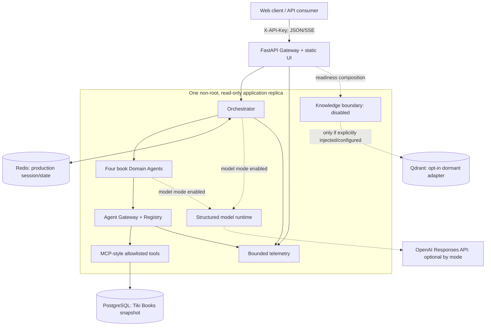
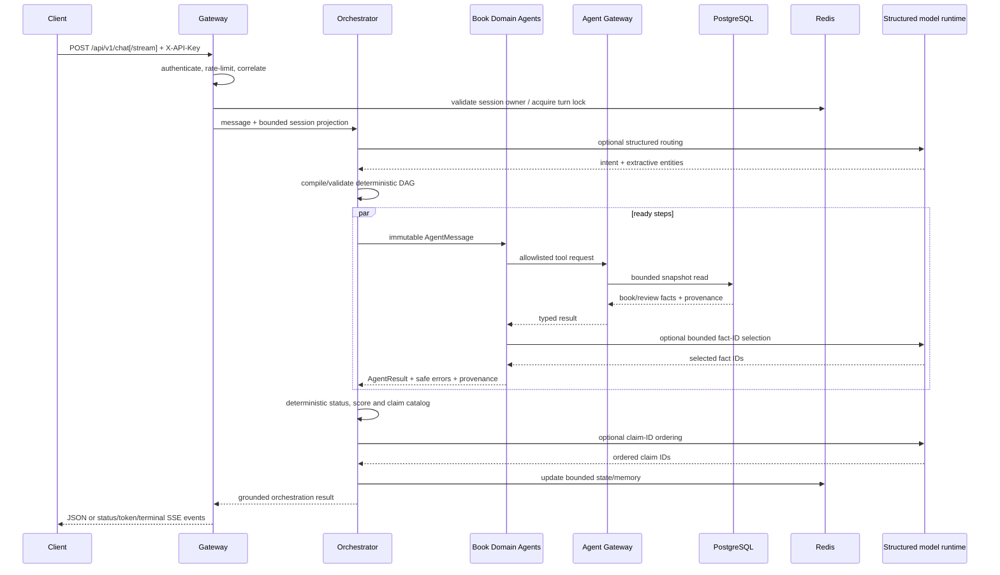

# Kiến trúc trợ lý sách

## 1. Mục tiêu và phạm vi

Hệ thống là **modular monolith** chuyên biệt cho câu hỏi sách tiếng Việt trên
snapshot lịch sử Tiki Books. Boundary giữa Gateway, Orchestrator, Domain Agent,
Agent Gateway, tools và shared state dùng typed contracts nhưng cùng chạy trong
một process. Cấu trúc này đủ để kiểm thử end-to-end và chưa đưa độ phức tạp
microservice vào khi chưa có tải thực tế chứng minh nhu cầu.

Mục tiêu hiện tại:

- trả lời từ book/review facts có provenance, không tự tạo catalog;
- điều phối bốn specialist cố định với DAG có kiểm tra quyền/dependency;
- hỗ trợ partial success và deterministic fallback có giới hạn;
- tái lập test/evaluation trên snapshot đã qua quality gate;
- giữ API v1 JSON/SSE ổn định và quan sát được mà không lộ nội dung nhạy cảm.

Ngoài phạm vi:

- crawl/feed Tiki trực tiếp hoặc dữ liệu người dùng thật;
- current inventory, current price, seller, trend, demand hay market-share claim;
- RAG corpus đang hoạt động, long-term personalization và semantic memory;
- sentiment/trust model đã hiệu chỉnh hoặc xác minh review giả/gian lận;
- nhiều replica, distributed rate limiter/tracing hoặc multi-region HA;
- claim superiority ngoài frozen evaluation protocol và rubric đã công bố.

[`workflow.md`](../workflow.md) là bản thiết kế generic lịch sử, không phải source
of truth cho runtime hiện hành.

## 2. Deployment view



Default Compose dùng PostgreSQL + Redis, rồi chạy:

```text
PostgreSQL healthy → migrate → quality-gated snapshot bootstrap → backend
Redis healthy ────────────────────────────────────────────────────┘
```

Qdrant nằm sau Compose profile `knowledge`, không phải dependency mặc định và
không có `seed-knowledge`. Helm production mặc định dùng external
PostgreSQL/Redis; kind dùng dependency nội bộ, model `off`, knowledge
`disabled`, migration và snapshot bootstrap. Cả hai profile Helm giới hạn một
application replica vì rate limiter, metric aggregation và trace ring còn nằm
trong process.

Container chạy UID/GID `10001`, read-only filesystem, drop capabilities và
không publish data services ra edge. TLS/reverse proxy, secret manager, backup
và external monitoring là trách nhiệm của deployment.

## 3. Logical components

| Component | Trách nhiệm | Failure/grounding boundary |
| --- | --- | --- |
| HTTP Gateway | Auth, rate limit, correlation, JSON/SSE, timeout | Stable v1 error envelope; owner-bound session |
| Intent Router | Book-only intent/entity extraction | Non-book request → `general.unsupported`; model entity phải extractive |
| Planner | Biên dịch intent thành authorized DAG | Model chỉ đề xuất capability; Python kiểm tra policy/dependency |
| Executor | Chạy ready steps đồng thời, bind upstream IDs | Exception thành typed safe error; giữ thứ tự candidate |
| Domain Agents | Product, Review, Trust, Market | Chỉ gọi tool qua Agent Gateway và trả typed provenance |
| Agent Gateway/Registry | Capability, permission, MCP routing, audit | Immutable allowlists; không log raw tool args/prompt |
| PostgreSQL tools | Search/compare/review/cross-sectional aggregate | Chỉ đọc snapshot đã import và gắn source profile |
| Model runtime | Routing/planning/fact selection/claim ordering | Structured schema, budget, circuit breaker, deterministic guard |
| Shared state | Session, active agent, last book, turn lock | Redis production; TTL và ownership |
| Knowledge boundary | No-op readiness seam | `disabled` mặc định; không có corpus/tool path RAG hiện tại |
| Telemetry | Metrics + bounded redacted traces | Không ghi key, prompt, review text hoặc provider raw response |

## 4. Request lifecycle



Correlation IDs được truyền xuyên suốt. Model modes:

| Mode | Semantics |
| --- | --- |
| `off` | Không gọi provider; deterministic pipeline |
| `shadow` | Gọi provider để telemetry nhưng giữ quyết định deterministic |
| `hybrid` | Dùng structured output hợp lệ; fallback deterministic khi được phép |
| `required` | Fail closed nếu provider hoặc evidence authorization lỗi |

## 5. Domain agents

Bốn ID domain cố định là:

| Agent ID | Trách nhiệm hiện tại | Active source |
| --- | --- | --- |
| `product_agent` | Search/filter, compare, rank book metadata | PostgreSQL products |
| `review_agent` | Retrieve, sentiment/aspect heuristic, summarize/compare | PostgreSQL sampled reviews |
| `trust_agent` | Complaint và text-quality heuristic | PostgreSQL sampled reviews |
| `market_agent` | Aggregate cắt ngang theo category/author/publisher/price/rating | PostgreSQL products |

Operations inventory còn liệt kê `orchestrator`, nên tổng registry inventory là
năm entry. Market Agent không đọc market notes và không tạo trend: output chủ
động đặt `representative_of_real_market=false`, `live_market_data=false` và
`trend_analysis=false`.

Product search hỗ trợ free text/title, author, publisher, category, min/max
price, min rating và min/max page count. Không có platform filter vì toàn bộ
normalized catalog thuộc một snapshot Tiki Books.

Multi-domain recommendation tạo DAG:

```text
product.rank (tối đa 5 candidates)
   ├── review.compare(all ranked product IDs)
   └── trust.compare(all ranked product IDs)
```

Hai nhánh sau Product có thể chạy đồng thời. Product failure làm request không
có grounded candidate; một auxiliary branch lỗi có thể tạo `partial_success`
với warning và không được thay bằng fact tự sinh.

## 6. Scoring và ranh giới claim

Ranking trong candidate set:

```text
product_score = 0.45 × rating/5
              + 0.35 × log(1 + source_popularity)/log(1 + max_popularity)
              + 0.20 × (1 - price/max_price)
```

Schema/tool compatibility vẫn xuất trường `sold_count`, nhưng nguồn thực là
`source_popularity` lịch sử của archive. Không được gọi nó là doanh số hiện tại
hoặc doanh số đã xác minh.

Recommendation score:

```text
0.55 × product_fit
+ 0.15 × positive_sentiment
+ 0.20 × (1 - complaint_rate)
+ 0.10 × review_text_quality
```

Nếu một auxiliary signal không phủ mọi candidate, signal đó bị bỏ cho toàn bộ
nhóm rồi trọng số còn lại được normalize. Heuristic sentiment/complaint/trust
chỉ mô tả text trong sampled reviews; không xác định gian lận, authenticity hoặc
chất lượng khách quan của sách.

Mọi answer đều nhắc snapshot lịch sử và không được diễn giải aggregate cắt
ngang thành catalog, giá, inventory hoặc thị trường Tiki hiện tại.

## 7. Grounded model boundary

Python sở hữu entity extraction, capability policy, DAG, fact text, status,
score, claim text và citation. Khi model bật:

- router chỉ được chọn intent/entity có trong bounded input;
- planner chỉ chọn capability đã đăng ký;
- specialist chỉ chọn opaque fact IDs từ server-owned catalog;
- synthesis chỉ sắp xếp claim IDs đã materialize;
- unknown/duplicate/ungrounded IDs bị fallback hoặc fail closed theo mode.

Provider calls dùng structured output, `store=false`, timeout/retry/concurrency
budget và circuit breaker. API/trace không công khai prompt, chain-of-thought,
raw provider payload hoặc raw tool arguments.

## 8. Data, state và knowledge

### PostgreSQL

Alembic head hiện tại là `20260830_0003`. Bảng `dataset_sources` giữ provenance
bất biến theo `(dataset_id, dataset_version, profile)`; product/review giữ
`source_id` và `external_id` cùng metadata sách normalized.

`ecommerce-seed` không sinh dữ liệu. Nó validate bốn snapshot artifacts, từ
chối database mixed/legacy/different-profile, import transactionally và kiểm tra
lại exact counts/provenance. Default là evaluation snapshot 200 sách/1.773
review. Xem [vòng đời dữ liệu](data.md).

### Redis và memory

Production dùng Redis cho owner-bound session, active agent, last product,
bounded turn storage và distributed turn lock. Mặc định TTL 3.600 giây, tối đa
40 user/assistant entries mỗi session. Router/model hiện chỉ nhận message hiện
tại và structured projection (`active_agent`, `last_product_id`); free-text
memory **chưa đưa vào routing hay aggregation**. Việc này tránh biến transcript
chưa lọc thành prompt. Hệ thống **chưa có long-term user memory**.

### Knowledge/RAG

`KNOWLEDGE_BACKEND=disabled` là mặc định cho local, Compose, Helm production và
kind. `DisabledKnowledgeStore` trả readiness thành công nhưng không retrieval.
Repository không bundle/seed knowledge documents và không có agent tool path
RAG hiện hành.

Qdrant adapter còn lại là seam opt-in cho một tích hợp tương lai. Chỉ khi chủ
động chọn `qdrant`, cung cấp credential và inject một collection tương thích,
readiness mới kiểm tra service, vector contract và collection không rỗng. Việc
có adapter không đồng nghĩa RAG đã tích hợp hoặc dữ liệu Qdrant có thể làm bằng
chứng cho answer hiện tại.

## 9. Reliability và API compatibility

- `/livez` chỉ phản ánh process.
- `/readyz` kiểm tra runtime, DB round-trip/current production revision, Redis
  nếu cấu hình và knowledge boundary. Default trả `knowledge: "disabled"`.
- Orchestration timeout trả 504 retryable; concurrent turn cùng session trả 409.
- Shared-state failure và all-agents-failed trả 503, không tạo fallback facts.
- SSE giữ ordered status, optional grounded token deltas, heartbeat và đúng một
  terminal `completed` hoặc `error`.
- Public request/response/event/error schema vẫn là API `v1`; việc chuyên biệt
  domain không đổi endpoint hoặc field names.

## 10. Security và observability

Trust boundaries gồm client API key, principal policy/tenant/scope, Agent
Gateway permission allowlist, authenticated data plane và operations credential
riêng. Production chặn demo/default credentials, memory shared state, legacy
`/chat` và model runtime bật mà thiếu provider key. Legacy
`KNOWLEDGE_BACKEND=static` được normalize thành `disabled`, không kích hoạt một
knowledge base ẩn.

Metrics dùng labels bounded; traces/audit là ring buffer redacted trong process.
Operator endpoints cho metrics, trace, audit và inventory cần operations key ở
production. Nhiều replica cần externalize limiter/telemetry trước khi bỏ giới
hạn hiện tại.

## 11. Trạng thái triển khai

| Area | Trạng thái |
| --- | --- |
| Book data | Test/eval snapshots đã clean, redact, quality-gate và hash |
| Agents | Product/Review/Trust/Market chuyên biệt cho books |
| Orchestrator | Authorized parallel DAG + deterministic/model-assisted modes |
| API/UI | Authenticated v1 JSON/SSE + same-origin evidence workspace |
| Deployment | Compose + Helm production/kind, migration/snapshot bootstrap |
| Evaluation | 28 Tiki cases + 16 robustness transformations; paired v2 |
| Knowledge/RAG | Disabled; dormant opt-in Qdrant adapter, không có corpus/tool path |
| Memory | TTL short-term state; chưa có long-term preference/summary/artifact memory |

Thứ tự mở rộng an toàn: định nghĩa licensed/versioned corpus RAG → quality gate
và provenance → inject retrieval adapter → shadow evaluation → human/semantic
rubric → load/chaos tests. Không bật Qdrant hoặc market claim chỉ vì adapter đã
tồn tại.
