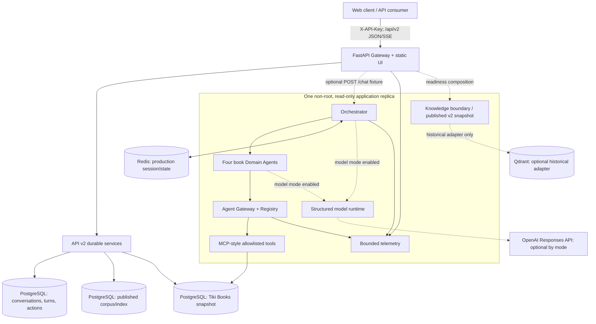
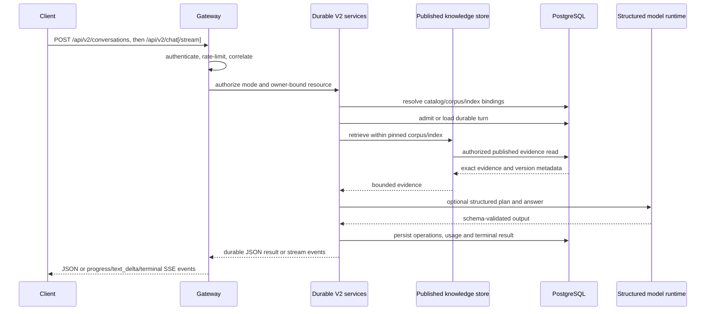

# Kiến trúc trợ lý sách

## 1. Mục tiêu và phạm vi

Hệ thống là **modular monolith** chuyên biệt cho câu hỏi sách tiếng Việt và các
turn v2 có evidence trên snapshot lịch sử Tiki Books. Boundary giữa Gateway,
Orchestrator, Domain Agent, Agent Gateway, tools và shared state dùng typed
contracts nhưng cùng chạy trong một process. Các contract lịch sử còn phục vụ
fixture/evaluation; `/api/v2` là API có version duy nhất, cung cấp durable
conversation/turn/action state và knowledge retrieval trên PostgreSQL. Các
route `/api/v1` đã bị gỡ.
`POST /chat` chỉ còn là fixture Phase 1 riêng, có cờ bật trong development.
Cấu trúc này đủ để kiểm thử end-to-end và chưa đưa độ phức tạp microservice
vào khi chưa có tải thực tế chứng minh nhu cầu.

Mục tiêu hiện tại:

- trả lời từ book/review facts có provenance, không tự tạo catalog;
- điều phối bốn specialist cố định với DAG có kiểm tra quyền/dependency;
- hỗ trợ partial success và deterministic fallback có giới hạn;
- tái lập test/evaluation trên snapshot đã qua quality gate;
- cung cấp một API v2 JSON/SSE bền vững, không lộ nội dung nhạy cảm;
- pin catalog, corpus và index version cho từng v2 turn trước khi dispatch.

Ngoài phạm vi:

- crawl/feed Tiki trực tiếp hoặc dữ liệu người dùng thật;
- current inventory, current price, seller, trend, demand hay market-share claim;
- long-term personalization và semantic memory;
- sentiment/trust model đã hiệu chỉnh hoặc xác minh review giả/gian lận;
- nhiều replica, distributed rate limiter/tracing hoặc multi-region HA;
- claim superiority ngoài frozen evaluation protocol và rubric đã công bố.

[`workflow.md`](../workflow.md) là bản thiết kế generic lịch sử, không phải source
of truth cho runtime hiện hành.

## 2. Deployment view



Default Compose dùng PostgreSQL + Redis, rồi chạy:

```text
PostgreSQL healthy → migrate → quality-gated snapshot bootstrap → backend
Redis healthy ────────────────────────────────────────────────────┘
```

Qdrant nằm sau Compose profile `knowledge`, không phải dependency mặc định và
không có `seed-knowledge`; V2 published corpus/index nằm trong
PostgreSQL. Helm production mặc định dùng external
PostgreSQL/Redis; kind dùng dependency nội bộ, model `off`, knowledge
`disabled`, migration và snapshot bootstrap. Cả hai profile Helm giới hạn một
application replica vì rate limiter, metric aggregation và trace ring còn nằm
trong process.

Container chạy UID/GID `10001`, read-only filesystem, drop capabilities và
không publish data services ra edge. TLS/reverse proxy, secret manager, backup
và external monitoring là trách nhiệm của deployment.

## 3. Logical components

| Component | Trách nhiệm | Failure/grounding boundary |
| --- | --- | --- |
| HTTP Gateway | Auth, rate limit, correlation, v2 JSON/SSE, timeout | V2 owner-bound resources; gated Phase 1 fixture |
| Intent Router | Book-only intent/entity extraction | Non-book request → `general.unsupported`; model entity phải extractive |
| Planner | Biên dịch intent thành authorized DAG | Model chỉ đề xuất capability; Python kiểm tra policy/dependency |
| Executor | Chạy ready steps đồng thời, bind upstream IDs | Exception thành typed safe error; giữ thứ tự candidate |
| Domain Agents | Product, Review, Trust, Market | Chỉ gọi tool qua Agent Gateway và trả typed provenance |
| Agent Gateway/Registry | Capability, permission, MCP routing, audit | Immutable allowlists; không log raw tool args/prompt |
| PostgreSQL tools | Search/compare/review/cross-sectional aggregate và v2 durable reads | Durable routes đọc rows/index đã publish và gắn version |
| Model runtime | Routing/planning/fact selection/claim ordering | Structured schema, budget, circuit breaker, deterministic guard |
| Shared state | Gated fixture state; durable v2 conversation/turn/action rows | PostgreSQL là authority cho V2 |
| Knowledge boundary | Published v2 corpus/index resolver | PostgreSQL corpus/index được publish và pin theo turn; Qdrant là adapter lịch sử |
| Telemetry | Metrics + bounded redacted traces | Không ghi key, prompt, review text hoặc provider raw response |

## 4. Request lifecycle



API v2 đi qua một lifecycle bền vững: gateway xác thực mode và owner,
ghi/admit conversation và client turn trong PostgreSQL, resolve catalog cùng
published corpus/index, rồi claim turn trước provider/tool dispatch. Các step,
lease, usage ledger, evidence binding và terminal result được lưu để retry hoặc
resume đọc lại trạng thái đã settle. V2 không dùng transcript memory của fixture
Phase 1 làm authority.

Correlation IDs được truyền xuyên suốt. Model modes:

| Mode | Semantics |
| --- | --- |
| `off` | Không gọi provider; deterministic pipeline |
| `shadow` | Gọi provider để telemetry nhưng giữ quyết định deterministic |
| `hybrid` | Dùng structured output hợp lệ; fallback deterministic khi được phép |
| `required` | Fail closed nếu provider hoặc evidence authorization lỗi |

## 5. Domain agents

Bốn ID domain cố định là:

| Agent ID | Trách nhiệm hiện tại | Active source |
| --- | --- | --- |
| `product_agent` | Search/filter, compare, rank book metadata | PostgreSQL products |
| `review_agent` | Retrieve, sentiment/aspect heuristic, summarize/compare | PostgreSQL sampled reviews |
| `trust_agent` | Complaint và text-quality heuristic | PostgreSQL sampled reviews |
| `market_agent` | Aggregate cắt ngang theo category/author/publisher/price/rating | PostgreSQL products |

Operations inventory còn liệt kê `orchestrator`, nên tổng registry inventory là
năm entry. Market Agent không đọc market notes và không tạo trend: output chủ
động đặt `representative_of_real_market=false`, `live_market_data=false` và
`trend_analysis=false`.

Product search hỗ trợ free text/title, author, publisher, category, min/max
price, min rating và min/max page count. Không có platform filter vì toàn bộ
normalized catalog thuộc một snapshot Tiki Books.

Multi-domain recommendation tạo DAG:

```text
product.rank (tối đa 5 candidates)
   ├── review.compare(all ranked product IDs)
   └── trust.compare(all ranked product IDs)
```

Hai nhánh sau Product có thể chạy đồng thời. Product failure làm request không
có grounded candidate; một auxiliary branch lỗi có thể tạo `partial_success`
với warning và không được thay bằng fact tự sinh.

## 6. Scoring và ranh giới claim

Ranking trong candidate set:

```text
product_score = 0.45 × rating/5
              + 0.35 × log(1 + source_popularity)/log(1 + max_popularity)
              + 0.20 × (1 - price/max_price)
```

Schema/tool compatibility vẫn xuất trường `sold_count`, nhưng nguồn thực là
`source_popularity` lịch sử của archive. Không được gọi nó là doanh số hiện tại
hoặc doanh số đã xác minh.

Recommendation score:

```text
0.55 × product_fit
+ 0.15 × positive_sentiment
+ 0.20 × (1 - complaint_rate)
+ 0.10 × review_text_quality
```

Nếu một auxiliary signal không phủ mọi candidate, signal đó bị bỏ cho toàn bộ
nhóm rồi trọng số còn lại được normalize. Heuristic sentiment/complaint/trust
chỉ mô tả text trong sampled reviews; không xác định gian lận, authenticity hoặc
chất lượng khách quan của sách.

Mọi answer đều nhắc snapshot lịch sử và không được diễn giải aggregate cắt
ngang thành catalog, giá, inventory hoặc thị trường Tiki hiện tại.

## 7. Grounded model boundary

Python sở hữu entity extraction, capability policy, DAG, fact text, status,
score, claim text và citation. Khi model bật:

- router chỉ được chọn intent/entity có trong bounded input;
- planner chỉ chọn capability đã đăng ký;
- specialist chỉ chọn opaque fact IDs từ server-owned catalog;
- synthesis chỉ sắp xếp claim IDs đã materialize;
- unknown/duplicate/ungrounded IDs bị fallback hoặc fail closed theo mode.

Provider calls dùng structured output, `store=false`, timeout/retry/concurrency
budget và circuit breaker. API/trace không công khai prompt, chain-of-thought,
raw provider payload hoặc raw tool arguments.

## 8. Data, state và knowledge

### PostgreSQL

Alembic production head hiện tại là `20260910_0008`, được khai báo trong
`app.db.migrate.EXPECTED_DATABASE_REVISION` và migration
`migrations/versions/20260910_0008_v2_sandbox_guards.py`. Các revision 0004–0008
bổ sung schema v2 cho hội thoại, sandbox, knowledge, ledger ngân sách, runtime
metadata và guard; migration không seed dữ liệu. Xem [foundation v2](thanh-v2/package-2-foundation.md).
Bảng `dataset_sources` giữ provenance bất biến theo
`(dataset_id, dataset_version, profile)`; product/review giữ `source_id` và
`external_id` cùng metadata sách normalized.

`ecommerce-seed` không sinh dữ liệu. Nó validate bốn snapshot artifacts, từ
chối database mixed/legacy/different-profile, import transactionally và kiểm tra
lại exact counts/provenance. Default là evaluation snapshot 200 sách/1.773
review. Xem [vòng đời dữ liệu](data.md).

### Redis và memory

Production settings yêu cầu Redis cho shared-state adapter của legacy runner;
`POST /chat` bị tắt trong production. Durable API v2 ghi conversation, turn,
action và memory vào PostgreSQL, không dùng Redis làm authority. Mặc định TTL
legacy là 3.600 giây, tối đa 40 user/assistant entries mỗi session. Router/model nhận message hiện
tại và structured projection (`active_agent`, `last_product_id`); free-text
memory **chưa đưa vào routing hay aggregation**. Việc này tránh biến transcript
chưa lọc thành prompt. Hệ thống **chưa có long-term user memory**.

### Knowledge/RAG

Historical Qdrant adapter mặc định tắt qua `KNOWLEDGE_BACKEND=disabled` và chỉ
dùng khi opt-in. API v2 không lấy knowledge từ Qdrant: nó mở
`PostgresKnowledgeStore`, resolve một snapshot đã publish theo
`V2_CORPUS_VERSION_ID`/`V2_INDEX_MANIFEST_ID`, rồi pin corpus/index vào từng
turn. Nếu thiếu binding, index chưa complete hoặc embedding model/dimension lệch,
v2 fail closed trước khi dispatch.

Runtime hiện hành bind corpus `books-v1-calibrated-20260909` với 20 sources,
chunks và vectors; 200 mappings gồm 20 exact work, 17 ambiguous và 163
unmatched; embedding là `text-embedding-3-small` với 1.536 dimensions. Corpus
chỉ chứa source notes/chunks/index data; benchmark Q/A và calibration artifacts
không được ingest.

## 9. Reliability và API compatibility

- `/livez` chỉ phản ánh process.
- `/readyz` kiểm tra runtime, DB round-trip/current production revision, Redis
  nếu cấu hình và knowledge boundary. Resolve corpus/index V2 fail-closed khi
  binding hoặc embedding contract sai.
- V2 turn conflict trả 409; database/runtime unavailable trả lỗi retryable.
- V2 SSE dùng `progress`, `text_delta` và một `terminal` event; client đọc lại
  turn để khôi phục sau disconnect.
- OpenAPI công bố `/api/v2` là versioned API duy nhất; `/api/v1` routes đã gỡ.

## 10. Security và observability

Trust boundaries gồm client API key, principal policy/tenant/scope, Agent
Gateway permission allowlist, authenticated data plane và operations credential
riêng. Production chặn demo/default credentials, memory shared state, legacy
`/chat` và model runtime bật mà thiếu provider key. Legacy
`KNOWLEDGE_BACKEND=static` được normalize thành `disabled`, không kích hoạt một
knowledge base ẩn.

Metrics dùng labels bounded; traces/audit là ring buffer redacted trong process.
Operator endpoints cho metrics, trace, audit và inventory cần operations key ở
production. Nhiều replica cần externalize limiter/telemetry trước khi bỏ giới
hạn hiện tại.

## 11. Trạng thái triển khai

| Area | Trạng thái |
| --- | --- |
| Book data | Test/eval snapshots đã clean, redact, quality-gate và hash |
| Agents | Product/Review/Trust/Market chuyên biệt cho books |
| Orchestrator | Authorized parallel DAG + deterministic/model-assisted modes |
| API/UI | V2 JSON/SSE/UI; `/api/v1` routes retired |
| Deployment | Compose + Helm production/kind, migration/snapshot bootstrap |
| Evaluation | Historical v1/v2 lanes preserved; P7 frozen protocol and P8 additive held-out driver |
| Knowledge/RAG | Historical Qdrant adapter disabled; V2 published PostgreSQL corpus/index |
| Memory | TTL short-term state; chưa có long-term preference/summary/artifact memory |

Thứ tự mở rộng an toàn: định nghĩa licensed/versioned corpus RAG → quality gate
và provenance → inject retrieval adapter → shadow evaluation → human/semantic
rubric → load/chaos tests. Không bật Qdrant hoặc market claim chỉ vì adapter đã
tồn tại.
