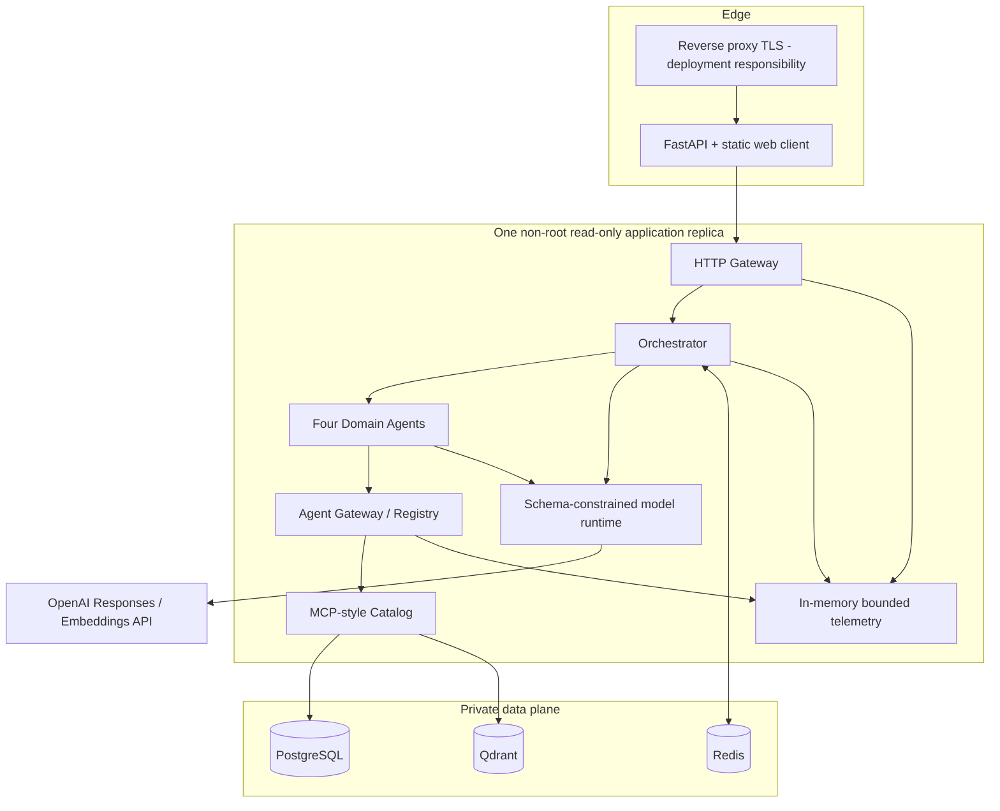
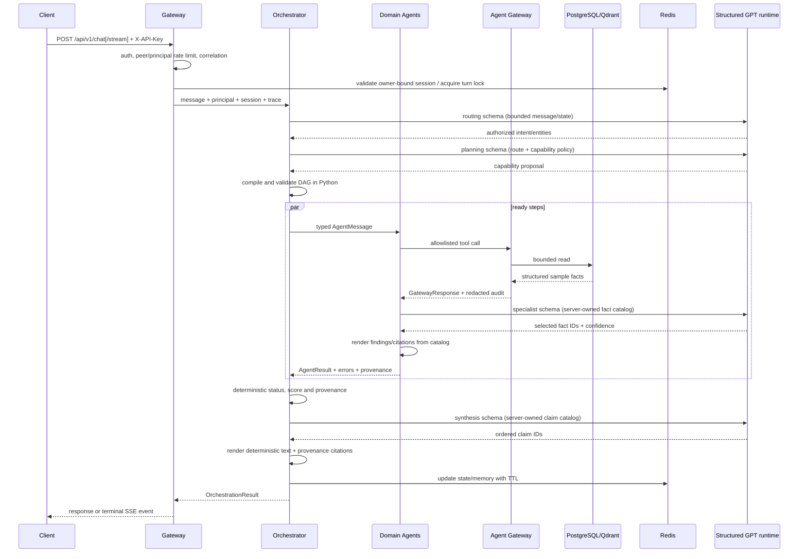

# Kiến trúc hệ thống

## 1. Mục tiêu và phạm vi

Hệ thống hiện thực hóa workflow multi-agent dưới dạng **modular monolith**: các
boundary được biểu diễn bằng contract và adapter rõ ràng nhưng vẫn chạy trong
một process để phù hợp quy mô khóa luận, dữ liệu mẫu và khả năng vận hành của
một nhóm nhỏ. Cách tiếp cận này giữ được khả năng kiểm thử end-to-end và tránh
đưa độ phức tạp mạng/phân tán vào trước khi có tải thực tế.

Mục tiêu:

- trả lời tiếng Việt dựa trên facts/provenance thay vì tự tạo thông tin;
- điều phối Product, Review, Trust và Market domain độc lập;
- hỗ trợ partial success khi một miền phụ trợ lỗi;
- dùng cùng typed contracts cho in-process A2A và transport tương lai;
- tái lập được trên dữ liệu mẫu, kể cả evaluation và failure injection;
- fail closed với production secrets/state/knowledge không an toàn.

Không thuộc phạm vi hiện tại:

- marketplace crawler và dữ liệu người dùng thật;
- fine-tuning hoặc mô hình sentiment/trust được hiệu chỉnh trên dữ liệu thật;
- long-term personalized memory cho preference, conversation summary và
  historical artifacts;
- microservice/service mesh và multi-region HA;
- distributed tracing backend, distributed rate limiter và nhiều replica;
- khẳng định superiority thống kê trước khi chạy trọn paired protocol v2 và
  bổ sung semantic/human rubric độc lập.

## 2. Deployment view



Hai deployment profile dùng cùng image và runtime contract:

- Compose production-like chỉ publish backend vào `127.0.0.1`; ba data service
  nằm trên internal network.
- Helm `production` dùng PostgreSQL/Redis/Qdrant bên ngoài và một existing
  Secret; Helm `kind` dựng dependency nội bộ cùng PVC để smoke hạ tầng.

Application chạy UID/GID `10001`, filesystem read-only, drop toàn bộ Linux
capabilities, bật seccomp `RuntimeDefault`/`no-new-privileges` và không tự mount
service-account token. NetworkPolicy giới hạn ingress/egress của workload.

Một Uvicorn worker và một application replica là lựa chọn có chủ đích vì inbound
rate limiter, metric aggregation và trace buffer hiện nằm trong process. Redis
đã cung cấp shared session/memory/turn-lock để bước scale-out sau không phải đổi
public contract, nhưng scale nhiều worker/replica chỉ hợp lệ sau khi chuyển rate
limit và telemetry sang distributed backend. Helm schema chặn `replicaCount`
khác `1` để giới hạn này không bị vô tình vi phạm.

## 3. Logical components

| Component | Input | Output | Failure boundary |
| --- | --- | --- | --- |
| Gateway | Authenticated HTTP payload | Stable JSON/SSE contract | 401/404/409/422/429/503/504 envelope |
| Intent Router | Message + bounded session state | `RoutedIntent` | Model intent; entity phải khớp extraction do Python sở hữu |
| Planner | `RoutedIntent` | Authorized `ExecutionPlan` DAG | Model chỉ chọn capability; Python biên dịch/kiểm tra DAG |
| Executor | Plan + correlation context | Ordered `AgentResult` tuple | Exceptions sanitized to typed agent error |
| Domain reasoner | Server-owned fact catalog | Evidence-linked fact selection | Model chỉ trả opaque fact ID + confidence |
| Aggregator | Intent + agent results | Grounded answer/status/warnings | Model chỉ sắp xếp claim ID; Python render text/citation |
| Model runtime | Bounded JSON + Pydantic schema | Validated structured object + redacted usage | Timeout/retry/concurrency/circuit breaker; no raw provider text |
| Agent Gateway | Agent request + registry policy | MCP tool response + audit | Agent/server/tool/permission allowlists |
| Repositories/tools | Validated arguments | JSON-friendly sample facts | Short DB sessions, rollback on exception |
| Shared state | Principal/session/memory | TTL-bound context | Redis outage becomes readiness/API 503 |
| Knowledge adapter | Sample note query | Qdrant matches + provenance | Bounded timeout/retry and contract checks |

## 4. Request lifecycle



Correlation IDs `request_id`, `trace_id`, `session_id`, `task_id`, `agent_id`
được truyền xuyên suốt. `off` bỏ qua model, `shadow` gọi model nhưng giữ kết quả
deterministic, `hybrid` dùng kết quả model hợp lệ và fallback an toàn,
`required` fail closed khi model hoặc authorization check lỗi. Access log/trace
chỉ ghi metadata model đã làm sạch (stage, snapshot, duration, token, fallback),
không chứa prompt, raw tool arguments, API key, provider response text hay nội
dung review.

## 5. Agent-to-Agent contract

`app/contracts/a2a.py` định nghĩa immutable Pydantic models:

- `AgentMessage`: source, target, action, correlation IDs và typed payload;
- `AgentResult`: terminal status, structured data, safe errors, provenance và
  duration;
- `ExecutionStep`: agent/action/input/dependencies;
- `ExecutionPlan`: DAG có step ID duy nhất và chỉ phụ thuộc step đã xuất hiện;
- `TaskStatus`: `pending`, `running`, `success`, `partial_success`, `failed`.

Contract không chứa transport-specific fields. Khi tách agent thành service,
adapter HTTP/message-bus có thể serialize cùng schema; planner/aggregator không
cần đổi semantics.

## 6. Domain agents và DAG

| Agent | Actions chính | Sources |
| --- | --- | --- |
| Product | search, rank, compare, statistics | PostgreSQL products/shops |
| Review | retrieve, sentiment, aspect, summarize, compare batch | PostgreSQL reviews |
| Trust | complaint, trust heuristic, compare batch | PostgreSQL reviews |
| Market | category statistics, market-note retrieval | PostgreSQL + Qdrant |

Recommendation đa miền tạo ba step:

```text
product.rank
   ├── review.compare(product_ids từ toàn bộ ranking)
   └── trust.compare(product_ids từ toàn bộ ranking)
```

Hai nhánh phụ trợ có thể chạy đồng thời sau Product step. Executor giữ nguyên
thứ tự candidate và giới hạn tối đa 5 IDs.

## 7. Scoring minh bạch

Product ranking trong một candidate set:

```text
product_score = 0.45 × rating/5
              + 0.35 × log(1 + sold)/log(1 + max_sold)
              + 0.20 × (1 - price/max_price)
```

Recommendation score:

```text
0.55 × product_fit
+ 0.15 × positive_sentiment
+ 0.20 × (1 - complaint_rate)
+ 0.10 × review_trust
```

Nếu một auxiliary signal không phủ mọi candidate, signal đó bị bỏ cho **tất
cả** candidate và phần trọng số còn lại được normalize. Tiebreak ổn định theo
score, source rank, price và product ID. Response công khai method, score,
coverage và nhãn heuristic/sample; trọng số là product policy phiên bản 1, chưa
được hiệu chỉnh bằng dữ liệu marketplace thật.

## 8. Data và state

### PostgreSQL

Nguồn sự thật cho shops/products/reviews. Alembic quản lý schema. Sample seed:

- idempotent khi DB khớp chính xác snapshot;
- từ chối DB lẫn hoặc có dữ liệu ngoài snapshot;
- reset cần hai flags và bị chặn ở production.

Schema `dataset_sources` lưu immutable dataset/version, license, source revision,
raw/snapshot SHA-256, sampling seed và row counts. Product/review imported từ
snapshot public giữ `source_id` + `external_id`; tool facts và AgentResult truyền
provenance động. Dữ liệu synthetic cũ vẫn có fallback source IDs riêng để không
trộn evidence giữa hai corpus.

### Redis

Lưu owner-bound session, active agent, last product, short-term memory và
distributed turn lock. Memory giữ tối đa 40 user/assistant turn entries mỗi
session, mỗi entry tối đa 2.000 ký tự; toàn bộ key hết hạn theo TTL mặc định
3.600 giây. Optimistic atomic update ngăn lost update; chỉ một turn được xử lý
trên một session tại một thời điểm.

Router/model runtime chỉ nhận message hiện tại và structured session projection
(`active_agent`, `last_product_id`); free-text memory được lưu cho lifecycle/audit
mở rộng nhưng chưa đưa vào routing hay aggregation, cũng không đưa vào specialist
reasoning. Thiết kế này tránh biến lịch sử hội thoại chưa được lọc thành prompt.
Muốn sử dụng phần text đó về sau phải có projection có giới hạn, chống prompt
injection và policy xóa/đồng ý riêng.

### Qdrant

Lưu market notes mẫu. Backend `hashing` dùng `hashed_token_cosine_v1` 128 chiều
để tái lập offline. Backend `openai` dùng embedding có version theo model/kích
thước; `auto` chọn OpenAI khi có key, nếu không dùng hashing ngoài production.
Mỗi không gian vector nằm ở collection suffix riêng (`_openai_v1` cho OpenAI),
không trộn vector không tương thích. Seed job kiểm tra schema trước upsert;
production readiness kiểm tra vector size/distance và yêu cầu collection có ít
nhất một point. API key không xuất hiện trong public settings/logs.

## 9. Reliability semantics

- Liveness chỉ phản ánh process. Production readiness yêu cầu DB đúng Alembic
  revision hiện hành, Redis ping thành công và Qdrant sống với collection đúng
  vector contract, không rỗng; development/test chỉ ping dependency đã cấu hình.
- Mỗi orchestration có timeout cấu hình; timeout trả 504 retryable.
- Concurrent turn cùng session trả 409 retryable thay vì ghi đè state.
- Redis/Qdrant outage trả trạng thái failed/503 có error code ổn định.
- Một agent phụ trợ lỗi có thể tạo `partial_success`; answer chỉ dùng phần dữ
  liệu còn lại và luôn kèm warning.
- Tất cả agents lỗi trả gateway 503; không có fallback tạo facts.
- Model call bị giới hạn timeout, retry, concurrency và circuit breaker. Chế độ
  `hybrid` fallback về kết quả deterministic đã tính; `required` dừng request.
- Router/planner/specialist/synthesis model outputs đều schema-constrained.
  Router entity phải khớp extraction Python, plan phải qua capability compiler,
  còn specialist/synthesis chỉ được chọn ID trong catalog server-owned; unknown,
  duplicate hoặc thiếu claim ID sẽ fallback/fail closed trước khi ảnh hưởng
  response.
- SSE luôn có `request.accepted`, progress có sequence và đúng một terminal
  `completed` hoặc `error`; heartbeat 10 giây giữ connection.

## 10. Security model

Trust boundaries:

1. Client → Gateway: API key, bounded body, auth-attempt limiter, per-principal
   limiter, constant-time compare.
2. Gateway → Orchestrator: principal/session ownership và correlation đã xác
   thực.
3. Agent → Agent Gateway: immutable registry, MCP server/tool/permission
   allowlists và outbound policy.
4. Application → Data: internal network, authenticated Redis/Qdrant/PostgreSQL.
5. Operator plane: `X-Operations-Key` hoặc `Authorization: Bearer` dùng cùng
   operations secret, tách khỏi user API key.

Production validation chặn demo/default/placeholder credentials, legacy route,
memory state và static knowledge. HTTP responses có CSP, frame denial, nosniff,
referrer/permissions policies, no-store cho API; docs/OpenAPI tắt ở production.
TLS termination, rotation, secret manager và firewall là trách nhiệm deployment.

## 11. Observability

- Access log: method, safe path label, status, request/trace IDs, latency.
- Trace ring: tối đa 5.000 redacted events/process.
- Metrics: HTTP/agent/model counters, readiness dependency counters và latency
  histograms với bucket cố định theo giây; labels được giới hạn, không chứa user
  path/ID.
- Operator endpoints: metrics, trace lookup, Agent Gateway audit và registry
  inventory, đều bảo vệ bằng operations key trong production.
- Helm có tùy chọn `ServiceMonitor`, `PrometheusRule` và Grafana dashboard;
  ServiceMonitor đọc Bearer credential từ existing Secret, không nhúng secret
  vào manifest.

Telemetry hiện không bền và không phân tán; production nhiều instance cần
Prometheus collector + OpenTelemetry/log backend bên ngoài.

## 12. Workflow coverage và evolution

| Workflow area | Trạng thái hiện tại |
| --- | --- |
| Single-agent baseline | Legacy path còn giữ; frozen real-model baseline từ `main` đã capture |
| Domain agents | Product, Review, Trust, Market đã triển khai |
| Orchestrator | GPT-assisted routing/planning/claim ordering, authorized parallel DAG, deterministic fallback/failure semantics |
| Specialist reasoning | GPT chọn fact ID theo từng AgentResult; Python sở hữu fact text và provenance |
| Shared platform | Session, Redis short-term turn storage, correlation, tracing, metrics, evaluation; chưa có long-term user memory |
| Agent Gateway/Registry | Capabilities, permissions, MCP allowlists, audit |
| MCP | In-process typed catalog; chưa phải remote MCP transport |
| RAG/vector DB | Qdrant adapter + versioned hashing/OpenAI embedding spaces |
| API/UI | Authenticated v1 JSON/SSE + same-origin evidence-first client |
| Deployment | Compose + Helm production/kind profiles, migration hook, NetworkPolicy, monitoring pack, CI gates |
| Evaluation | Paired protocol v2: deterministic/full hybrid + four ablations, 28 clean + 16 robustness cases, pinned runtime/retrieval/pricing/hashes |

Khi thay dữ liệu thật, thứ tự mở rộng an toàn là: data contract/quality gate →
versioned embedding/index → shadow evaluation → chạy đủ paired protocol + human
rubric → calibrated analytics/ranking → load/chaos tests → distributed rate
limit/telemetry → cân nhắc tách service theo bottleneck đo được.
