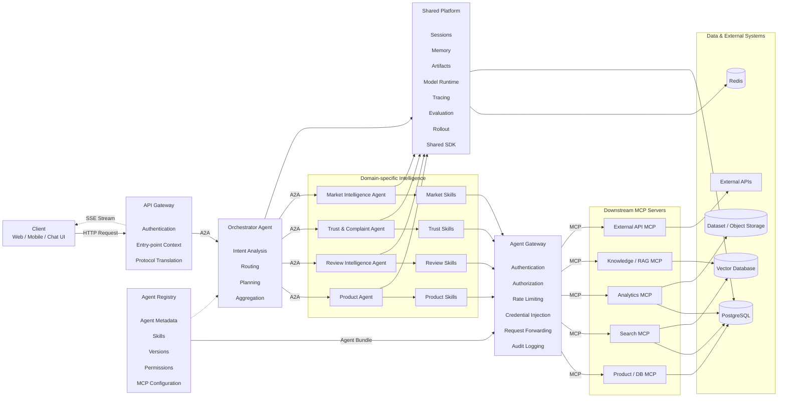

> [!WARNING]
> **Tài liệu thiết kế lịch sử.** Nội dung bên dưới mô tả kiến trúc thương mại
> điện tử tổng quát trước khi hệ thống được chuyên biệt hóa cho snapshot lịch sử
> Tiki Books. Các ví dụ sản phẩm generic, RAG/Qdrant, knowledge seed và lộ trình
> phân tán bên dưới **không mô tả runtime hiện tại**. Xem
> [`README.md`](README.md), [`docs/architecture.md`](docs/architecture.md),
> [`docs/data.md`](docs/data.md) và [`docs/operations.md`](docs/operations.md)
> để biết source of truth có thể chạy/review. Các URL `/api/v1` trong bản thiết
> kế này đã bị gỡ; API hiện hành nằm tại `/api/v2`.

# Vietnamese E-commerce Multi-Agent Platform Architecture (historical)

## 1. Overview

Hệ thống được thiết kế theo kiến trúc Multi-Agent, trong đó:

- Client cung cấp giao diện tương tác cho người dùng.
- Gateway là entry point duy nhất của hệ thống.
- Orchestrator Agent phân tích yêu cầu và điều phối các Domain Agent.
- Domain Agent phụ trách từng nhóm nghiệp vụ riêng.
- Skill cung cấp các khả năng cụ thể cho từng Agent.
- Shared Platform cung cấp session, memory, tracing, model runtime và evaluation.
- Registry quản lý metadata, version, capability và cấu hình của Agent.
- Agent Gateway kiểm soát toàn bộ outbound access.
- MCP Server kết nối hệ thống Agent với database, API và dịch vụ bên ngoài.

---

# 2. High-Level Architecture



---

# 3. Request Flow

Luồng xử lý tổng quát:

```text
Client
  ↓
API Gateway
  ↓
Orchestrator Agent
  ↓
Domain Agent
  ↓
Skill
  ↓
Agent Gateway
  ↓
MCP Server
  ↓
Database / Vector DB / External API
  ↓
Domain Agent
  ↓
Orchestrator
  ↓
Gateway
  ↓
Client
```

Ví dụ:

```text
User:
"Tìm tai nghe dưới 1 triệu,
bán tốt và ít bị khách phàn nàn."

                    ↓

                Gateway

                    ↓

              Orchestrator

             ↙             ↘

      Product Agent     Review Agent
            ↓                ↓
      search products    get reviews
            ↓                ↓
      Product Skill      Review Skill

             ↘             ↙

          Trust Agent
               ↓
       Complaint Analysis

               ↓

            Ranking

               ↓

           Orchestrator

               ↓

        Final Recommendation
```

---

# 4. Client Layer

## Responsibilities

Client chịu trách nhiệm:

- gửi request;
- hiển thị conversation;
- hiển thị intermediate agent status;
- nhận streaming response;
- quản lý user session ở phía frontend.

Ví dụ:

```text
Web Application
Mobile Application
Admin Dashboard
Chat Interface
```

Protocol:

```text
Client → Gateway
HTTP / HTTPS

Gateway → Client
SSE
```

SSE được sử dụng để stream:

```text
Analyzing request...
Searching products...
Analyzing reviews...
Ranking candidates...
Generating response...
```

---

# 5. API Gateway

Gateway là entry point duy nhất từ bên ngoài.

## Responsibilities

```text
Authentication
Request validation
Session identification
Rate limiting
Entry-point context
Protocol translation
SSE streaming
Request ID generation
```

Ví dụ:

```http
POST /api/v1/chat
```

Request:

```json
{
  "session_id": "session_123",
  "message": "Tìm tai nghe dưới 1 triệu có review tốt"
}
```

Gateway không chứa business logic.

Gateway chỉ chuyển request sang Orchestrator.

---

# 6. Orchestrator Agent

Orchestrator là trung tâm điều phối của hệ thống.

## Responsibilities

```text
Intent Detection
Task Decomposition
Agent Selection
Execution Planning
Agent Coordination
Result Aggregation
Failure Handling
Final Response Generation
```

Ví dụ:

```text
"Tìm sản phẩm bán tốt nhưng bị complaint nhiều"
```

Orchestrator có thể sinh execution plan:

```text
1. Product Agent
   → lấy sản phẩm có số lượng bán cao

2. Review Agent
   → lấy review tương ứng

3. Trust Agent
   → lọc spam review

4. Complaint Agent
   → tính complaint rate

5. Product Agent
   → ranking

6. Orchestrator
   → tổng hợp kết quả
```

---

# 7. A2A Communication

A2A là Agent-to-Agent communication layer.

Dùng cho:

```text
Gateway → Orchestrator

Orchestrator → Domain Agent

Domain Agent → Domain Agent
```

Message có thể chuẩn hóa:

```json
{
  "task_id": "task_001",
  "session_id": "session_123",
  "source": "orchestrator",
  "target": "product_agent",
  "action": "search_products",
  "input": {
    "category": "tai nghe",
    "max_price": 1000000
  }
}
```

Response:

```json
{
  "task_id": "task_001",
  "status": "success",
  "data": {
    "products": []
  }
}
```

---

# 8. Product Agent

Product Agent chịu trách nhiệm về dữ liệu và reasoning liên quan đến sản phẩm.

## Responsibilities

```text
Product Search
Product Filtering
Product Comparison
Product Ranking
Category Analysis
Price Analysis
Popularity Analysis
```

## Skills

```text
search_products()
get_product()
filter_products()
compare_products()
rank_products()
get_product_statistics()
```

Ví dụ:

```text
User:
"Tìm smartphone dưới 8 triệu"

Product Agent
    ↓
search_products()
    ↓
filter_products()
    ↓
rank_products()
```

---

# 9. Review Intelligence Agent

Review Agent chuyên xử lý review tiếng Việt.

## Responsibilities

```text
Review Retrieval
Sentiment Analysis
Aspect Extraction
Review Summarization
Issue Detection
Review Aggregation
```

## Skills

```text
get_reviews()
analyze_sentiment()
extract_aspects()
summarize_reviews()
calculate_sentiment_distribution()
```

Ví dụ:

```text
"Sản phẩm này khách đang chê gì?"
```

Output nội bộ:

```json
{
  "positive": 0.68,
  "neutral": 0.11,
  "negative": 0.21,
  "negative_aspects": [
    "packaging",
    "delivery",
    "battery"
  ]
}
```

---

# 10. Trust & Complaint Agent

Agent này chịu trách nhiệm đánh giá độ tin cậy của review và phát hiện complaint.

## Responsibilities

```text
Spam Review Detection
Fake Review Detection
Complaint Detection
Review Quality Scoring
Abnormal Pattern Detection
```

## Skills

```text
detect_spam()
detect_complaint()
calculate_trust_score()
detect_abnormal_reviews()
```

Ví dụ:

```text
Review
   ↓
Spam Detection
   ↓
Trust Score
   ↓
Complaint Detection
```

Kết quả:

```json
{
  "spam_probability": 0.12,
  "trust_score": 0.88,
  "complaint": true
}
```

---

# 11. Market Intelligence Agent

Market Agent xử lý dữ liệu cấp thị trường.

## Responsibilities

```text
Market Trend Analysis
Category Analysis
Price Trend Analysis
Competitive Analysis
Report Retrieval
Market Question Answering
```

## Skills

```text
analyze_market()
analyze_category()
analyze_price_trend()
search_market_reports()
compare_market_segments()
```

Có thể kết hợp:

```text
Structured Data
+
Vietnamese E-commerce Reports
+
RAG
```

---

# 12. Skill Layer

Skill là capability cụ thể được Agent sử dụng.

Agent:

```text
quyết định làm gì
```

Skill:

```text
thực hiện tác vụ cụ thể
```

Ví dụ:

```text
Product Agent
│
├── search_products
├── rank_products
├── compare_products
└── analyze_price
```

Skill không nhất thiết là một microservice riêng.

Trong MVP:

```text
Agent
 ↓
Python Service
```

Trong production:

```text
Agent
 ↓
Skill
 ↓
Agent Gateway
 ↓
MCP
```

---

# 13. Shared Platform

Shared Platform cung cấp infrastructure dùng chung cho toàn bộ Agent.

```text
Orchestrator ─────┐
Product Agent ────┤
Review Agent ─────┤
Trust Agent ──────┼── Shared Platform
Market Agent ─────┘
```

## 13.1 Session

Quản lý:

```text
user_id
session_id
conversation_id
active_agent
conversation state
```

Redis có thể được sử dụng cho session ngắn hạn.

---

## 13.2 Memory

### Short-term Memory

```text
Redis
```

Lưu:

```text
conversation context
active task
recent tool outputs
```

### Long-term Memory

```text
PostgreSQL
Vector Database
```

Lưu:

```text
conversation summary
user preference
historical artifacts
knowledge embeddings
```

---

# 14. Agent Pinning

Sau khi Orchestrator đã route request sang một domain cụ thể, follow-up request có thể tiếp tục đi tới agent đó.

Ví dụ:

```text
User:
"So sánh iPhone 15 với Galaxy S24"

        ↓

Product Agent
```

User tiếp tục:

```text
"Còn pin thì sao?"
```

Không cần:

```text
Gateway
 ↓
Orchestrator
 ↓
Product Agent
```

Có thể:

```text
Gateway
 ↓
Product Agent
```

Nếu conversation chuyển domain:

```text
"Khách phàn nàn gì về Galaxy S24?"
```

request quay về Orchestrator:

```text
Product Agent
      ↓
Orchestrator
      ↓
Review Agent
```

---

# 15. Model Runtime

Shared Platform quản lý model configuration.

Ví dụ:

```yaml
models:

  orchestrator:
    provider: openai
    model: gpt-x

  product_agent:
    provider: openai
    model: gpt-x-mini

  review_agent:
    provider: local
    model: vietnamese-sentiment-model
```

Mục tiêu:

```text
Agent không hard-code model
```

Agent chỉ gọi:

```text
model_runtime.generate()
```

---

# 16. Tracing

Mỗi request phải có:

```text
trace_id
request_id
session_id
task_id
agent_id
```

Ví dụ trace:

```text
Request #REQ-142

Gateway
  20 ms

Orchestrator
  850 ms

Product Agent
  420 ms

Review Agent
  1.6 s

Trust Agent
  680 ms

Orchestrator aggregation
  700 ms

TOTAL
  4.27 s
```

Có thể sử dụng:

```text
OpenTelemetry
Langfuse
```

---

# 17. Evaluation

Shared Platform lưu evaluation data.

Metrics:

```text
Routing Accuracy

Tool Selection Accuracy

Task Success Rate

Answer Accuracy

Retrieval Precision

Latency

Token Usage

LLM Cost

Agent Failure Rate
```

Một phần quan trọng của project:

```text
Single Agent
       VS
Multi-Agent
```

Benchmark:

```text
Simple Query
Complex Query
Multi-domain Query
Missing Data
Tool Failure
Ambiguous Query
Irrelevant Query
```

---

# 18. Agent Registry

Registry là danh bạ của Agent.

Ví dụ:

```yaml
agents:

  product_agent:
    version: 1.0.0

    capabilities:
      - product_search
      - product_compare
      - product_ranking

    skills:
      - search_products
      - compare_products
      - rank_products


  review_agent:
    version: 1.0.0

    capabilities:
      - review_analysis
      - sentiment_analysis

    skills:
      - get_reviews
      - analyze_sentiment
      - summarize_reviews
```

Registry cung cấp thông tin cho:

```text
Orchestrator
Agent Gateway
Deployment System
```

---

# 19. Agent Bundle

Registry có thể tạo Agent Bundle.

Ví dụ:

```json
{
  "agent_id": "product_agent",
  "version": "1.0.0",
  "permissions": [
    "product.read",
    "review.read"
  ],
  "mcp_servers": [
    "product-db",
    "analytics"
  ],
  "rate_limit": {
    "requests_per_minute": 120
  }
}
```

Agent Gateway sử dụng Bundle để xác định:

```text
Agent được gọi MCP nào?

Agent được truy cập resource nào?

Rate limit bao nhiêu?

Credential nào được phép inject?
```

---

# 20. Agent Gateway

Agent Gateway là security boundary cho outbound communication.

```text
Agent
 ↓
Skill
 ↓
Agent Gateway
 ↓
MCP Server
 ↓
External System
```

## Responsibilities

```text
Authentication
Authorization
Rate Limiting
Credential Injection
Request Validation
Audit Logging
Request Forwarding
```

Agent không được giữ trực tiếp:

```text
Database password
API key
External service token
```

Credential được Agent Gateway quản lý.

---

# 21. MCP Layer

MCP cung cấp interface chuẩn để Agent sử dụng các system bên ngoài.

Architecture:

```text
Agent
 ↓
Skill
 ↓
Agent Gateway
 ↓
MCP Client
 ↓
MCP Server
 ↓
External System
```

Các MCP Server có thể gồm:

```text
Product Database MCP

Review Database MCP

Analytics MCP

Search MCP

Knowledge / RAG MCP

External API MCP
```

---

# 22. Data Layer

## PostgreSQL

Lưu structured data.

```text
products
shops
reviews
users
categories
price_history
agent_logs
sessions
evaluation_results
```

Ví dụ:

```text
products
------------------
product_id
name
category_id
shop_id
price
rating
sold
platform
created_at
updated_at
```

```text
reviews
------------------
review_id
product_id
user_id
rating
text
created_at
platform
```

---

# 23. Vector Database

Có thể sử dụng:

```text
Qdrant
```

Lưu embedding của:

```text
product descriptions
reviews
market reports
knowledge documents
conversation memory
```

Dùng cho:

```text
Semantic Search
RAG
Product Retrieval
Review Retrieval
Knowledge Retrieval
```

---

# 24. Redis

Redis dùng cho:

```text
Session
Short-term Memory
Cache
Agent Pinning
Task State
Distributed Lock
```

Ví dụ:

```text
session:123
→ active_agent = product_agent

task:456
→ status = running
```

---

# 25. Storage

Object storage dùng cho:

```text
raw datasets
images
model artifacts
evaluation artifacts
reports
exports
```

Có thể dùng:

```text
Local filesystem

hoặc

MinIO
```

---

# 26. Error Handling

Mỗi layer phải có error boundary.

```text
Client
 ↓
Gateway Error Handler
 ↓
Orchestrator Recovery
 ↓
Agent Error Handler
 ↓
Skill Error Handler
 ↓
Agent Gateway Retry
 ↓
MCP Error Handler
```

Ví dụ:

```text
Product MCP unavailable
        ↓
Agent Gateway retry
        ↓
retry failed
        ↓
Product Agent returns partial failure
        ↓
Orchestrator decides fallback
```

Response:

```json
{
  "status": "partial_success",
  "message": "Không thể lấy dữ liệu giá mới nhất.",
  "available_data": {}
}
```

Không để LLM tự bịa dữ liệu khi tool fail.

---

# 27. Security Model

Security chia thành hai boundary.

## Inbound Boundary

```text
Client
 ↓
API Gateway
```

Gateway kiểm tra:

```text
authentication
authorization
rate limit
payload validation
session
```

## Outbound Boundary

```text
Agent
 ↓
Agent Gateway
 ↓
MCP
```

Agent Gateway kiểm tra:

```text
agent identity
tool permission
resource permission
credentials
rate limit
audit
```

---

# 28. Observability

Hệ thống cần ba nhóm telemetry.

## Logs

```text
request logs
agent logs
tool logs
error logs
security logs
```

## Metrics

```text
requests/sec
latency
error rate
LLM tokens
LLM cost
agent calls
MCP calls
cache hit rate
```

## Traces

```text
Client
 ↓
Gateway
 ↓
Orchestrator
 ↓
Product Agent
 ↓
Product MCP
 ↓
Database
```

Toàn bộ phải giữ cùng:

```text
trace_id
```

---

# 29. Suggested Repository Structure

```text
ecommerce-multi-agent/
│
├── app/
│   │
│   ├── main.py
│   │
│   ├── gateway/
│   │   ├── routes/
│   │   ├── middleware/
│   │   └── sse/
│   │
│   ├── orchestrator/
│   │   ├── agent.py
│   │   ├── planner.py
│   │   ├── router.py
│   │   └── aggregator.py
│   │
│   ├── agents/
│   │   │
│   │   ├── product/
│   │   │   ├── agent.py
│   │   │   └── skills.py
│   │   │
│   │   ├── review/
│   │   │   ├── agent.py
│   │   │   └── skills.py
│   │   │
│   │   ├── trust/
│   │   │   ├── agent.py
│   │   │   └── skills.py
│   │   │
│   │   └── market/
│   │       ├── agent.py
│   │       └── skills.py
│   │
│   ├── shared/
│   │   ├── memory/
│   │   ├── session/
│   │   ├── tracing/
│   │   ├── evaluation/
│   │   └── models/
│   │
│   ├── registry/
│   │   ├── registry.py
│   │   └── agents.yaml
│   │
│   ├── agent_gateway/
│   │   ├── gateway.py
│   │   ├── auth.py
│   │   ├── permissions.py
│   │   └── rate_limit.py
│   │
│   ├── mcp/
│   │   ├── product/
│   │   ├── review/
│   │   ├── analytics/
│   │   └── knowledge/
│   │
│   ├── services/
│   │   ├── database.py
│   │   ├── embeddings.py
│   │   └── llm.py
│   │
│   └── schemas/
│
├── data/
│   ├── raw/
│   ├── processed/
│   └── migrations/
│
├── evaluation/
│   ├── datasets/
│   ├── benchmarks/
│   └── reports/
│
├── tests/
│   ├── unit/
│   ├── integration/
│   └── e2e/
│
├── frontend/
│
├── docker/
│
├── compose.yaml
├── Dockerfile
├── pyproject.toml
├── .env.example
└── README.md
```

---

# 30. Runtime Architecture

Phiên bản đồ án không cần deploy toàn bộ thành microservices.

Có thể chạy:

```text
Docker Compose

├── frontend
├── backend
├── postgres
├── redis
├── qdrant
└── observability
```

Trong backend:

```text
FastAPI Process

├── Gateway
├── Orchestrator
├── Product Agent
├── Review Agent
├── Trust Agent
├── Market Agent
├── Registry
└── Agent Gateway
```

Điều này vẫn giữ architecture logic:

```text
Multi-Agent
A2A
Shared Platform
MCP
Registry
Gateway
```

nhưng không tạo quá nhiều network service khi chưa cần.

---

# 31. Production Evolution

## Phase 1: Modular Monolith

```text
FastAPI

├── Gateway
├── Orchestrator
├── Agents
├── Shared Platform
└── Agent Gateway
```

Best choice cho project ban đầu.

---

## Phase 2: Containerized Agents

```text
Gateway

Orchestrator

Product Agent

Review Agent

Trust Agent

Market Agent
```

Mỗi Agent có container riêng.

A2A trở thành network communication thật.

---

## Phase 3: Distributed Multi-Agent Platform

```text
Load Balancer
      ↓
API Gateway
      ↓
Orchestrator Pool
      ↓
Agent Pool
      ↓
Agent Gateway
      ↓
MCP Infrastructure
```

Có thể bổ sung:

```text
Autoscaling
Service Discovery
Distributed Tracing
Central Registry
Secrets Manager
Message Queue
Kubernetes
```

---

# 32. MVP Scope

Phiên bản MVP chỉ cần:

```text
Client
   ↓
FastAPI Gateway
   ↓
Orchestrator
   ↓
┌─────────────────────┐
│ Product Agent       │
│ Review Agent        │
│ Trust Agent         │
└─────────────────────┘
   ↓
Skills
   ↓
PostgreSQL / Qdrant
```

Shared infrastructure:

```text
Redis
Tracing
Evaluation
```

Chưa bắt buộc:

```text
Distributed Registry
Kubernetes
Service Mesh
Dynamic Agent Discovery
Independent Agent Deployment
```

---

# 33. Recommended Implementation Order

```text
1. Use Cases

        ↓

2. Data Contract

        ↓

3. PostgreSQL / Data Layer

        ↓

4. Skills / Tools

        ↓

5. Single-Agent Baseline

        ↓

6. Domain Agents

        ↓

7. Orchestrator

        ↓

8. Multi-Agent MVP

        ↓

9. Shared Platform
   ├── Session
   ├── Memory
   ├── Tracing
   └── Evaluation

        ↓

10. MCP

        ↓

11. Agent Gateway

        ↓

12. Registry

        ↓

13. SSE / Frontend

        ↓

14. Evaluation

        ↓

15. Production Extensions
```

---

# 34. Final Architecture

```text
                         CLIENT
                           │
                      HTTP │ ▲ SSE
                           ▼ │
                    ┌─────────────┐
                    │ API Gateway │
                    └──────┬──────┘
                           │ A2A
                           ▼
                  ┌──────────────────┐
                  │   Orchestrator   │
                  └────────┬─────────┘
                           │
              ┌────────────┼─────────────┐
              │            │             │
              ▼            ▼             ▼
        Product Agent  Review Agent   Trust Agent
              │            │             │
              ▼            ▼             ▼
            Skills       Skills        Skills
              │            │             │
              └────────────┼─────────────┘
                           │
                           ▼
                  ┌──────────────────┐
                  │  Agent Gateway   │
                  └────────┬─────────┘
                           │ MCP
             ┌─────────────┼──────────────┐
             ▼             ▼              ▼
         Database       Analytics        RAG
           MCP             MCP           MCP
             │             │              │
             ▼             ▼              ▼
        PostgreSQL     Data / Models    Qdrant


       ┌─────────────────────────────────────┐
       │           Shared Platform           │
       │                                     │
       │ Session │ Memory │ Models │ Tracing │
       │ Eval    │ Cache  │ Artifact         │
       └─────────────────────────────────────┘
                     ▲
                     │
              All Agents use it


                     Registry
                        │
                    Agent Bundle
                        │
                        ▼
                  Agent Gateway
```

---

# 35. Architectural Principle

Hệ thống tuân theo nguyên tắc:

```text
Gateway
    = kiểm soát request đi vào

Orchestrator
    = quyết định ai làm gì

Agent
    = chuyên gia theo domain

Skill
    = khả năng thực thi cụ thể

Shared Platform
    = infrastructure dùng chung

Registry
    = danh bạ và cấu hình Agent

Agent Gateway
    = kiểm soát request đi ra

MCP
    = chuẩn kết nối external systems

Database / API
    = nguồn dữ liệu và hành động thực tế
```

Tóm lại:

```text
USER REQUEST
      ↓
UNDERSTAND
      ↓
PLAN
      ↓
ROUTE
      ↓
EXECUTE
      ↓
RETRIEVE / ACT
      ↓
AGGREGATE
      ↓
RESPOND
```
